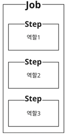

# 1. 배치 기본 구성(Job & Step)

예시 코드를 통해 기본적인 Job을 작성하고 실행해본다.  
스프링 배치를 본격적으로 알아보기 전에 기본적인 job 구성을 파악한다.  

## 1.1 Job
Spring Batch는 Job이라는 단위로 작업을 분류한다.      
소위 말하는 Batch Job을 의미하는데 이 Job은 **일련의 작업을 수행**한다. 예를 들어, "_한 기능에 대한 배치를 작성해야돼_"라고 한다면, 하나의 Batch Job을 만든다는 의미다.  

<br>

## 1.2 Step
이 Job은 **Step**이라는 녀석을 한 개 이상 가진다.
이 Step은 **실제 배치 작업을 수행하는 역할**을 가지며, 데이터 조회나 배치 로직 실행 등과 같이 Job을 실제로 수행하는 녀석이다. 즉, 이 Step은 여러가지 역할을 가질 수 있다.    
만약 아래와 같이 Step이 역할별(e.g. 데이터 조회 수행, 실제 배치 로직 수행, 데이터 저장 수행 등)로 분리된다면, 각 역할별 Step이 하나의 Job 안에 묶이는 셈이다.  




하나의 Job안에는 여러 Step을 정의할 수 있으며, 이 **Step들이 모여서** 1.1의 Job에서 이야기한 **일련의 작업**이 되는 것이다.   
또한, Job이 여러 개의 Step을 가지듯, Step도 어떻게 구성하느냐에 따라서 내부 구성이 달라질 수 있는데 이는 [Step과 관련된 글](../batch04/README.md)에서 자세히 다룬다.  

---

# 2. Job & Step 정의

실제로 **Job을 정의**하고, **Step을 통해 배치 로직을 구현**해보자. [[코드 참고]](src/main/java/sj/batch/stepAndJob/job/TransferNewUserJobConfiguration.java)

#### - UserService.java
```java
@Service
@RequiredArgsConstructor
public class UserService {

    private final UserRepository userRepository;

    public List<User> getUsersRegisteredYesterday() {
        final LocalDateTime start = LocalDateTime.now().minusDays(1).withHour(0).withMinute(0).withSecond(0).withNano(0);
        final LocalDateTime end = LocalDateTime.now().withHour(0).withMinute(0).withSecond(0).withNano(0);
        return userRepository.findByRegisteredAtBetween(start, end);
    }
}
```
- 자정 기준(00:00:00.000)으로 어제 하루동안 신규 가입된 유저를 조회하기 위해 getUsersRegisteredYesterday() 메서드를 사용한다. 

<br>

#### - TransferNewUserJobConfiguration.java
```java
@Slf4j
@Configuration
@RequiredArgsConstructor
public class TransferNewUserJobConfiguration {

    private final JobRepository jobRepository;
    private final PlatformTransactionManager platformTransactionManager;
    private static final String JOB_NAME = "TRANSFER_NEW_USER_JOB";
    private static final String STEP_1_NAME = "TRANSFER_NEW_USER_STEP";

    private final UserService userService;

    @Bean
    public Job transferNewUserJob() {
        return new JobBuilder(JOB_NAME, jobRepository) // JobBuilder를 통해 Job을 정의한다.
            .start(transferNewUserStep()) // 아래 정의한 step을 Job에 속하도록 집어 넣는다.
            .build();
    }

    @Bean
    public Step transferNewUserStep() {
        return new StepBuilder(STEP_1_NAME, jobRepository) // StepBuilder를 통해 Step을 정의한다.
            .tasklet((contribution, chunkContext) -> { // Step 로직을 정의
                final List<User> users = userService.getUsersRegisteredYesterday();
                log.info("{} 명의 유저 정보를 AML 등의 서비스로 전송", users.size());
                return RepeatStatus.FINISHED;
            }, platformTransactionManager)
            .build();
    }
} 
```

여기서 봐야할 내용은 딱 두가지다. `transferNewUserJob()`와 `transferNewUserStep()`이다.  
위 클래스를 언뜻 보면, Spring에서 설정 파일에 Bean을 등록하는 것처럼 보인다.  

맞다. Spring Batch에서는 `@Configuration`을 통해, Job을 Bean으로 등록한다. 

지금 여기서 중요한 것은 **StepBuilder를 통해 Step을 정의**하고, **정의한 Step을 JobBuilder를 통해 Job에 끼워 넣었다는 점**이다.  
테스트를 통해 위 코드를 실행 시켜보자.  

---

## 2.1 테스트 작성

[[코드참고](src/test/java/sj/batch/stepAndJob/job/TransferNewUserJobConfigurationTest.java)]

```java
@Testcontainers
@SpringBootTest
@SpringBatchTest
class TransferNewUserJobConfigurationTest extends TestTemplate {

    @Autowired
    private Job transferNewUserJob;
    @Autowired
    private JobLauncherTestUtils jobLauncherTestUtils;

    @Autowired
    private UserRepository userRepository;
    @Autowired
    private DatabaseTemplate databaseTemplate;

    @BeforeEach
    void setup() {
        jobLauncherTestUtils.setJob(transferNewUserJob);
        databaseTemplate.truncate();
    }

    @Test
    @SneakyThrows
    void run() throws Exception{
        // given
        final User user = UserFixture.create(LocalDateTime.now().minusDays(1));
        userRepository.save(user);

        // when
        JobExecution jobExecution = jobLauncherTestUtils.launchJob();

        // then
        assertThat(jobExecution.getStatus()).isEqualTo(BatchStatus.COMPLETED);
    }
}
```

- `@SpringBatchTest`는 배치 테스트를 위한 Component 등을 자동으로 Bean으로 제공해주는 역할을 한다.
- `TestTemplate`는 MySQL 환경에서 배치 테스트를 하기 위해, 정의해놓은 [설정 파일](./src/test/java/sj/batch/stepAndJob/support/template/TestTemplate.java)이다.(TestContainer를 통해 띄움) 

<br>

위 테스트를 통해 `TransferNewUserJobConfiguration#transferNewUserJob()`을 실행한다.   
결과를 확인하기에 앞서 예상되는 Job 실행 순서는 아래와 같다.  
1. Job 실행 시작
2. 정의한 Step 실행
3. Job 종료 (결과 반환)

<br>

실제 로그는 아래와 같다.  


1. **첫번째 박스**  
`TRANSFER_NEW_USER_JOB`이란 이름을 가진 JOB이 실행되었다. 그런데, 따라오는 parameters 값이 있다. 
자세한 내용은 [Job 정리 글](../batch02/README.md)에서 다루지만, 우선은 **Job 실행을 고유하게 식별하기 위한 값**이라고 이해하면 된다.   
random이라는 키로 하여금 Long 타입의 value값이 있다. 
이는 `JobLauncherTestUtils`에서 제공해주는 값으로 중복 Job 실행을 막기 위한 값이다. 참고로 **중복 Job 여부의 기준은 JobParameter 값**이다. 
때문에, 테스트 환경에서 중복 Job에 의한 제약을 막기위해 제공하고 있다.(Job은 중복실행을 허용하지 않음)   

2. **두번째 박스**  
Job 내부에 정의한 Step이 실행된다. Step 내부에 정의된 데이터 조회 쿼리(`select ~~`)와 로그("1 명의 유저 정보를 AML 등의 서비스로 전송")가 찍힌 것을 확인할 수 있다.  

3. **세번째 박스**
Job이 완료되었고, 상태는 `COMPLETED`로 정상처리 되었음을 의미한다.
