# 3. Job의 구성방식 및 실행방식 - JobLauncher & Job & JobRepository

[지난 글]()에서 Job에 대한 기본적인 개념에 대해 다뤘다. 
Job에서 시작하여 JobInsatnce를 알아봤고, JobInstance를 구별하는 핵심인 JobParameters에 대해 알아봤다. 
그리고, 이 Job의 실행 자체를 의미하는 JobExecution까지 알아봤다.  

이번 글에서는 아래와 같은 질문들에 답을 찾아볼 예정이다.  
- _Job이 실제로 어떻게 실행되는가?_
- _Job과 관련된 데이터가 어떻게 저장되고 관리되는가?_

결론부터 이야기 하면, 아래와 같은 다이어그램으로 표시할 수 있다. 
JobLauncher는 Job을 실행하고, JobRepository는 Job과 관련된 데이터를 저장하고 관리한다.

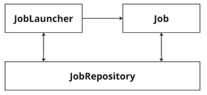

또한, 이 글을 통해 (지난 글에서 예시로 다뤘던) JobBuilder의 동작 원리에 대해서도 이해할 수 있을 것이다.  
자세히 살펴보자.

Job, JobRepository, JobLauncher를 본격적으로 다루기 전에 예시코드를 먼저 살펴보자.  

#### - TransferNewUserJobConfiguration.java
```java
@Slf4j
@Configuration
@RequiredArgsConstructor
public class TransferNewUserJobConfiguration {

    private final JobRepository jobRepository;
    private final PlatformTransactionManager platformTransactionManager;
    private static final String JOB_NAME = "TRANSFER_NEW_USER_JOB";
    private static final String STEP_1_NAME = "TRANSFER_NEW_USER_STEP";

    private final UserService userService;

    @Bean
    public Job transferNewUserJob() {
        return new JobBuilder(JOB_NAME, jobRepository)
            .start(transferNewUserStep(null))
            .build();
    }

    @Bean
    @JobScope
    public Step transferNewUserStep(
        @Value("#{jobParameters['targetDate']}") LocalDate targetDate
    ) {
        return new StepBuilder(STEP_1_NAME, jobRepository)
            .tasklet((contribution, chunkContext) -> {
                final List<User> users = userService.findByRegisteredDate(targetDate);
                log.info("{} 명의 유저 정보를 AML 등의 서비스로 전송", users.size());
                return RepeatStatus.FINISHED;
            }, platformTransactionManager)
            .build();
    }
}
```

[이전 글]()에서 사용하던 코드와 100% 동일하다.  
여기서는 코드에 대한 설명은 생략하고, Bean으로 등록된 Job인 `transferNewUserJob`이 어떤 원리로 실행되는지 살펴볼 것이다.  
때문에, 현재 예제에서는 코드의 일부인 아래부분만 신경쓰면 된다.  

```java
@Bean
public Job transferNewUserJob() { // transferNewUserJob의 실행 구조를 트래킹해보자.
    return new JobBuilder(JOB_NAME, jobRepository)
        .start(transferNewUserStep(null))
        .build();
}
```

## 3.1 Job의 구성 요소와 실행 흐름
Spring Batch 5.1 기준, Job의 종류에는 아래 네 가지가 있다.  

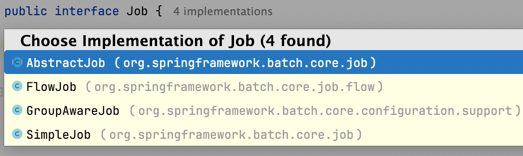

엔티티 다이어그램으로 표현하면, 아래와 같다.
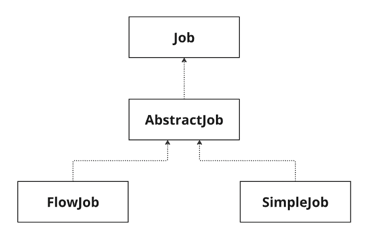

Job 인터페이스를 구현하고 있는 AbstractJob이란 추상클래스가 존재한다. 이 추상클래스의 역할은 템플릿 메서드 패턴의 역할을 한다. 자세한 내용은 아래 디버깅을 통해서 확인한다.  
Job 구성에 따라서, SimpleJob 혹은 FlowJob으로 나눌 수 있다. 이는 AbstractJob을 상속받아 Job 실행방식을 구현한다.  
위 예제와 같이 구성한 Job에서는 SimpleJob이 실행되는데, **어떤 원리로 실행**되는지 디버깅을 통해 알아볼 것이다.    

그 전에, @Configuration을 통해 Job을 정의할 때, SimpleJob 혹은 FlowJob이 **어떤 원리로 생성**되는지 알아야 한다.  
해당 예제에서는 기본적으로 SimpleJob이 생성되는 방식을 설명할 것이다. FlowJob도 비슷한 원리로 디버깅하면 그 원리를 파악할 수 있을 것이다.  


### 3.1.1 Job 생성 원리
아래 Job을 생성하는 것을 기준으로 설명한다.  
```java
@Bean
public Job transferNewUserJob() {
    return new JobBuilder(JOB_NAME, jobRepository)
        .start(transferNewUserStep(null))
        .build();
}
```

<br>

### 3.1.1.1 JobBuilder() 호출

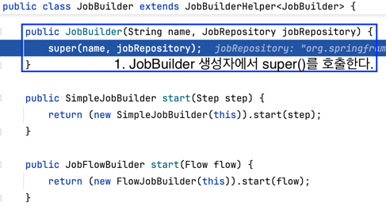  

`new JobBuilder()`를 통해 JobBuilder 생성자를 호출했고, 내부적으로 JobBuilderHelper 생성자를 호출하고 있다.  

<br>

### 3.1.1.2 상위 클래스인 JobBuilderHelper() 호출: Job 속성값 저장

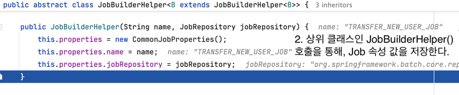   

JobBuilderHelper()에서는 properties 객체 내부에 속성 값들을 저장하고 있다.  
`CommonJobProperties`는 JobBuilderHelper 클래스의 내부 클래스로 정의되어 있으며, Job 실행에 필요한 다양한 속성 값들을 내부 필드로 가지고 있다.  

<br>

### 3.1.1.3 JobBuilder 객체 생성 & JobBuilder::start() 호출


위 1,2 과정(`new JobBuilder()`)을 통해 JobBuilder 객체를 생성했다. 그 다음은 start()메서드를 호출할 차례다. JobBuilder::start()를 확인해보면 아래와 같다.

<br>
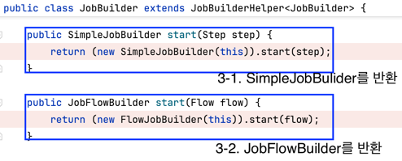   

start() 메서드가 오버로딩 되어 있는데, 하나의 파라미터 타입은 Step이고, 다른 하나의 파라미터 타입은 Flow다.  
즉, **start()에 넘기는 인자에 따라서 SimpleJob을 생성할 지, FlowJob을 생성할 지 결정**되는 것이다.

<br>
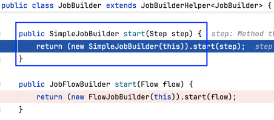     

현재 예제에서는 `step`을 인자로 넘겼기 때문에 SimpleJobBuilder를 리턴한다.  
그리고, `new SimpleJobBuilder.start()`를 통해서 SimpleJobBuilder를 리턴하는데, 아래 이미지를 보자.   

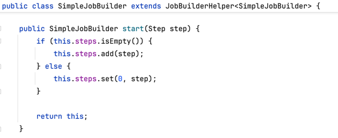  

**SimpleJobBuilder 클래스는 List<Step> 타입의 steps라는 멤버변수를 가지고 있다.**
SimpleJobBuilder::start() 메서드는 내부적으로 Job에 정의된 step들을 steps 리스트에 저장한다. 

<br>

### 3.1.1.4 SimpleJobBuilder::build() 호출을 통해 SimpleJob 생성
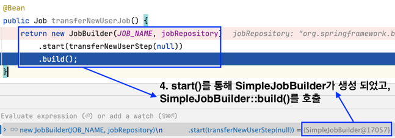   

3번에서의 start()를 통해서 SimpleJobBuilder가 생성되었고, SimpleJobBuilder::build()를 호출하게 되는 것이다.

<br>
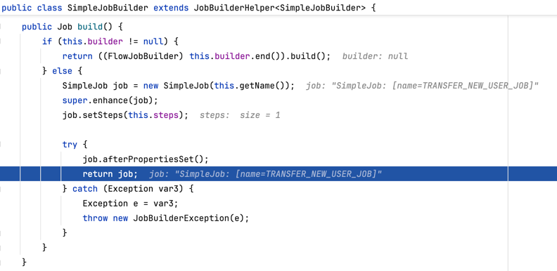

결과적으로 위에 보이는 SimpleJobBuilder::build() 메서드를 호출을 통해 Job 객체를 반환 시킨다.  
내부 로직을 보면, `new SimpleJob()`을 통해 SimpleJob을 생성해서 리턴하는 것을 확인할 수 있다. 

추가로 SimpleJob은 List<Step> 타입의 멤버변수인 steps를 가지고 있다.  

`job.setSteps(this.steps)`를 보자.  
**SimpleJobBuilder 필드에 저장된 steps 변수를 SimpleJob::setSteps()를 통해 SimpleJob에 업데이트 하고 있다.**  
뒤에 나오는 내용이지만, **SimpleJob 내부에서는 이 step변수에 저장된 step들을 실행**하는 것이다.  

여기서 알 수 있는 또다른 사실은 **JobBuilder가 직접 SimpleJob을 생성하지 않고, SimpleJobBuilder에게 그 역할을 위임**하는 것이다. 
이러한 내용을 바탕으로 엔티티 관계 다이어그램을 표현하면 아래와 같다.

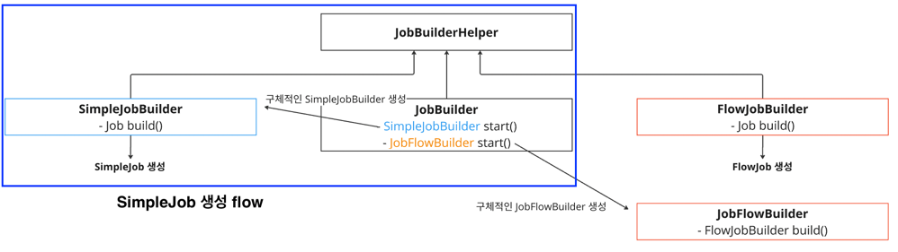

SimpleJob 생성 플로우를 디버깅을 통해 파악하고, 다이어그램을 통해 자세히 파악했다. FlowJob은 생성 흐름이 아주 조금 달라서 여기서는 생략했다. 별도 포스팅으로 정리할 예정이다.   

---

### 3.1.2 SimpleJob 동작 원리 (w. JobLauncher)
3.1.1절에서 Job이 생성되는 원리를 파악했다. 이렇게 **생성된 Job이 어떻게 실행되는지** 알아보자.  
이번 절을 통해 Job이 어떻게 중복 체크를 하는지, 어떻게 상태 관리를 하는지 등을 알 수 있을 것이다.  
그리고, 위에서 잠깐 언급했던 AbstractJob과 그 구현체들의 관계에 대해서도 파악할 수 있다.


#### 3.1.2.1 Job은 JobLauncher가 실행시킨다. (예제 시나리오 및 Job 정의)

Job을 정의하는 방법은 앞선 글들에서 설명했으므로, 넘어간다. 그리고, 이번 글 3.1.1절에서 Job 생성 원리에 대해 파악해보았다.  
그럼, 이제 이렇게 정의한 Job을 실행시켜야 할 것이다. 우선 정의한 시나리오와 Job은 아래와 같다.  

```markdown
- 전일 가입한 유저를 AML 서버로 전달해야 한다. (AML, Anti-Money Laundering: 자금세탁행위를 차단하기 위한 관리 체계)
- 하루가 끝나는 "자정"에 한 번 실행된다.
```

```java
@Slf4j
@Configuration
@RequiredArgsConstructor
public class TransferNewUserJobConfiguration {

    private final JobRepository jobRepository;
    private final PlatformTransactionManager platformTransactionManager;
    private static final String JOB_NAME = "TRANSFER_NEW_USER_JOB";
    private static final String STEP_1_NAME = "TRANSFER_NEW_USER_STEP";

    private final UserService userService;

    @Bean
    public Job transferNewUserJob() {
        return new JobBuilder(JOB_NAME, jobRepository)
            .start(transferNewUserStep(null))
            .build();
    }


    @Bean
    @JobScope
    public Step transferNewUserStep(
        @Value("#{jobParameters['targetDate']}") LocalDate targetDate
    ) {
        return new StepBuilder(STEP_1_NAME, jobRepository)
            .tasklet((contribution, chunkContext) -> {
                final List<User> users = userService.findByRegisteredDate(targetDate);
                log.info("{} 명의 유저 정보를 AML 등의 서비스로 전송", users.size());
                return RepeatStatus.FINISHED;
            }, platformTransactionManager)
            .build();
    }
}
```

---

이제 위 Job을 실행 시키기 위해, JobLauncher를 이용한다. 코드 작성/실행을 통해 JobLaucnher 내부 로직을 살펴보자.  

```java
@Configuration
@RequiredArgsConstructor
public class TransferNewUserJobLauncherConfiguration extends QuartzJobBean {

    private final JobLauncher jobLauncher;
    private final Job transferNewUserJob;

    @SneakyThrows
    @Override
    protected void executeInternal(JobExecutionContext context) {
        final JobParameters jobParameters = new JobParametersBuilder()
            .addLocalDate("tartgetDate", LocalDateTime.now().minusDays(1).toLocalDate())
            .toJobParameters();
        jobLauncher.run(transferNewUserJob, jobParameters);
    }
}
```
QuartzJobBean은 스케줄링을 통해 해당 Job을 실행시키기 위한 목적으로 상속받았다. 
간단히 말해서, `QuartzJobBean`을 사용하여 executeInternal()라는 메서드를 오버라이드해 작업을 정의한 것이고, 이를 Quartz 스케줄러로 실행하는 예제이다.   
(현재 시나리오는 자정에 맞춰 Job이 실행되어야 하므로 위와 같은 방식으로 구성)

중요한 부분은 JobLauncher를 주입받고, `jobLauncher.run()`을 통해 Job을 실행한다는 것이다.  
우리는 앞선 글에서 JobParameters를 구성하는 방법을 알아봤고, JobParameters가 특정 Job을 식별하는데 중요한 역할을 한다는 것을 알았다.  
때문에, jobLauncher가 Job을 실행하기 위해서 run()메서드에 Job과 JobParameters를 파라미터로 정의한 것을 알 수 있다.  

그렇다면, **JobLauncher::run()이 내부적으로 어떻게 동작**하는지 실행을 통해 알아보자!!


----

실행을 통해 알아보기 위해 아래와 같이 테스트코드를 작성 했다.  
```java
@Testcontainers
@SpringBootTest
@SpringBatchTest
class TransferNewUserJobConfigurationTest extends TestTemplate {

    @Autowired
    private Job transferNewUserJob;
    @Autowired
    private JobLauncher jobLauncher;

    @Autowired
    private UserRepository userRepository;
    @Autowired
    private DatabaseTemplate databaseTemplate;

    @BeforeEach
    void setup() {
        databaseTemplate.truncate();
    }

    @Test
    @SneakyThrows
    void run1() throws Exception {
        // given
        final User user = UserFixture.create(LocalDateTime.now().minusDays(1));
        userRepository.save(user);

        // when
        final JobParameters jobParameters1 = new JobParametersBuilder()
            .addLocalDate("targetDate", LocalDateTime.now().minusDays(1).toLocalDate())
            .toJobParameters();
        JobExecution jobExecution = jobLauncher.run(transferNewUserJob, jobParameters1);
    }
}
```

지난 글에서 실행했던 JobLauncherTestUtils와 달리, 이번 글에서만큼은 JobLauncher를 직접 주입받았다.(결국에 JobLauncherTestUtils도 내부적으로는 JobLauncher 사용 함)

----

<br>

#### 3.1.2.2 [JobLauncher::run()의 동작 방식 1] 
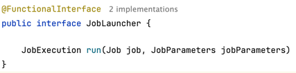   

JobLauncher는 run() 메서드 하나만 정의해놓은 함수형 인터페이스다. run()을 통해 Job을 실행시키고, 실행을 의미하는 JobExecution을 반환한다. [(batch03 참고)](../batch03/README.md)  
JobLuancher 인터페이스의 구현체는 두 가지가 있다. `TaskExecutorJobLauncher`와 `SimpleJobLauncher`이다. 정확히는 `TaskExecutorJobLauncher`가 `SimpleJobLauncher`를 상속받아 처리하고 있는데, 
이는 deprecated 될(or 된)  `SimpleJobLauncher`를 확장한 클래스라고 이히하면 된다. 아래는  `TaskExecutorJobLauncher` 코드다.  

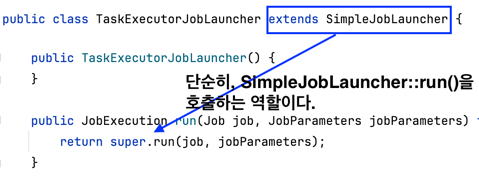   

때문에, 여기서는 SimpleJobLauncher::run()을 중점적으로 파헤쳐보자.

<br>

#### 3.1.2.3 [JobLauncher::run()의 동작 방식 2]

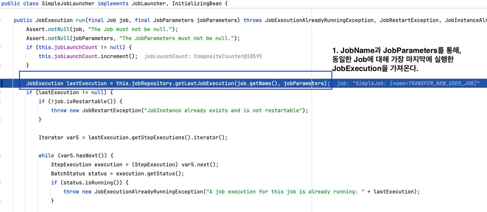   
Job을 식별하는 JobName&JobParameters를 통해, 가장 최근에 실행한 JobExecution을 가져온다.  
그리고, 마지막 JobExecution이 있다면, 바로 아래 줄로 이동해 재시작 가능 여부(restartable)를 판단 하거나, 실행 상태를 확인해 적절한 예외를 발생 시킨다.

<br><br>

#### 3.1.2.4 [JobLauncher::run()의 동작 방식 3]

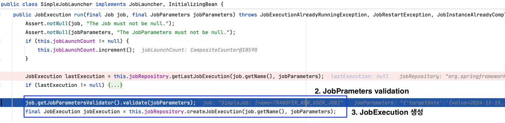
2번 코드는 JobParameters를 검증하는 부분인데, JobParamters 검증은 `JobParametersValidator`를 타입의 Bean으로 할 수 있다. 
이는 JobBuilder를 통해 Job을 정의할 때 설정할 수 있다. (해당 시나리오를 예로 들면, targetDate가 null은 아닌지, 원하는 날짜가 맞는지 등 검증할 수 있다.)  

3번 코드는 (3.2 절에서 다룰 내용이지만) JobExecution을 생성하는 부분인데, `JobRepository`가 주어진 JobParameters와 관련된 새 `JobExecution` 객체를 생성한다. 

<br>

#### 3.1.2.5 [JobLauncher::run()의 동작 방식 4]

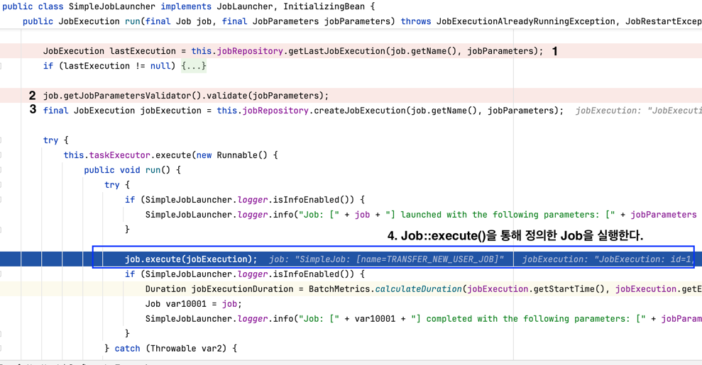   

JobLauncer의 역할은 결국 Job을 실행시키는 것이다. 앞서 본 1,2번은 Job의 실행/파라미터 상태 등을 검증하는 부분이고, 3번은 정의한 Job을 실제로 실행시키기 위한 JobExecution 생성.  
그리고, 마지막으로 Job::execute() 호출을 통해 Job을 실행 시키는 것이다. 그렇다면, Job::execute()은 어떻게 동작할까??  
바로 이어서 알아보자.  

----

3.1 절에서 Job 생성 과정에서 AbstractJob이나 SimpleJob을 이야기 했었다. JobLauncher가 실행시키는 Job은 결국 이녀석들 중 하나일 것이다.  
설명에 앞서, 3.1절에서 이야기한 `Job` 엔티티 다이어그램을 기억하면 좋다. 다시 한번 가져와 보자.  


본 글 초반에 정의한 `transferNewUserJob`은 SimpleJob이었다. 즉, JobLauncher를 통해 실행시킨 Job은 결국 SimpleJob이다. 
다시 한번 실행을 통해 하나하나 파악해보자.  

<br>

#### 3.1.2.6 [JobLauncher::run()의 동작 방식 5 -> Job::execute()의 동작 방식 1]
JobLauncher를 통해 Job을 실행시키면, 내부적으로 `job.execute()`이 수행된다. 자, 그럼 바로 job.execute() 내부동작을 더 알아보자.  

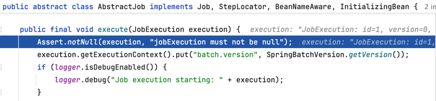   

3.1.2.5에서의 job은 `SimpleJob`이었다. 하지만, JobLauncher내 job.execute()가 호출하는 job은 위 사진처럼 AbstractJob이다.  
이전에 SimpleJob은 AbstractJob을 상속 받는 구조라고 설명한 적이 있다. 그리고, SimpleJob은 AbstractJob의 execute()를 구현하고 있지 않기 때문에, AbstractJob::execute()가 실행된다.  

#### 3.1.2.7 [JobLauncher::run()의 동작 방식 5 -> Job::execute()의 동작 방식 2]

어쨌든, JobLauncher에서 job.execute()를 실행 시키면, AbstractJob::execute()가 호출되는 구조다. 그렇다면, AbstarctJob::execute()를 좀 더 살펴보자.  
아래는 코드를 가져온 것이다.(AbstractJob::execute() 코드를 가져왔지만, 중요하다고 생각한 부분만 설명하기 위해 일부 코드는 제거했다.)  

```java
public abstract class AbstractJob implements Job, StepLocator, BeanNameAware, InitializingBean{
    
    public final void execute(JobExecution jobExecution) {
        try {
            this.jobParametersValidator.validate(execution.getJobParameters()); // 1. jobParameters validation
            if (execution.getStatus() != BatchStatus.STOPPING) {
                execution.setStartTime(LocalDateTime.now());
                this.updateStatus(execution, BatchStatus.STARTED);
                this.listener.beforeJob(execution); // 2. beforeJob 실행 

                try {
                    this.doExecute(execution); // 3. doExecute() 실행: 구현체인 SimpleJob::execute()가 실행 됨
                    if (logger.isDebugEnabled()) {
                        logger.debug("Job execution complete: " + execution);
                    }
                } catch (RepeatException var96) { // 실제로 정의한 Job을 실행하다가 예외가 발생하면, 예외를 던짐
                    RepeatException e = var96;
                    throw e.getCause();
                }
            } else {
                // ...
            }
        } catch (Throwable e) {
            // ...
            execution.setExitStatus(this.getDefaultExitStatusForFailure(t, execution));
            execution.setStatus(BatchStatus.FAILED); // 4. 예외가 발생하면, JobExecution 상태를 FAILED로 변경
            execution.addFailureException(t);
        } finally {
            execution.setEndTime(LocalDateTime.now()); // 5. JobExecution이 종료되었으므로, EndTime을 저장

            this.listener.afterJob(execution); // 5. afterJob 실행
            this.jobRepository.update(execution); // 5. JobExecution의 데이터를 저장
            JobSynchronizationManager.release();
        }
    }
}
```

위 코드 기반으로, **JobLauncher를 통해 실행한 SimpleJob의 실행 구조**는 아래와 같다.  

1. `this.jobParametersValidator.validate()`를 통해 JobParameters를 검증한다. 3.1.2.4절에서 파라미터를 검증했는데, 그때 호출한 validate()와 동일하다. 
2. `this.listener.beforeJob()`를 통해 beforeJob을 호출한다. 이 listener는 `JobExecutionListener`라는 인터페이스인데, 이 인터페이스에는 두 메서드가 있다.  
   - **beforeJob(JobExecution jobExecution)**: Job 실행 전 호출
   - **afterJob(JobExecution jobExecution)**: Job 실행 후 호출  
   
   위 두 메서드가 각각 Job 실행 전/후에 실행되는 이유가 바로 이 코드에 있는 것이다. [JobExecutionListener를 구현하는 예시 코드](src/main/java/batch2/job/BatchJobExecutionListener.java)를 통해 명확하게 확인해볼 수 있다.  

3. `this.doExecute()`를 통해 정의한 Job이 실행된다. 여기서는 this의 주체가 SimpleJob이다. 그리고, SimpleJob은 doExecute()를 구현하고 있다. 
즉, `SimpleJob::doExecute()`가 실행된다. 위에서 정의한 `TRANSFER_NEW_USER_JOB`이 실행된다.
4. Job 실행 도중 예외가 발생하면, JobExecution 상태를 FAILED로 변경한다.
5. JobExecution이 종료되고, 종료시간 저장 -> afterJob 실행 -> JobExecution 데이터 저장 순으로 Job 실행이 종료된다.  


근데, 여기서 한 가지 넘어간 부분이 있다. 바로, JobExecution의 상태를 `COMPLETED`로 변경하는 부분이다. 
해당 로직은 사실 doExecute() 구현체인 SimpleJob::doExecute()에 있는데, 해당 로직은 대부분 Step 내용이 포함되어 있어 [step 관련 글](../batch04/README.md)에서 별도로 설명한다.  
여기서는 "SimpleJob::doExecute()가 COMPLETED 상태로 변경한다" 정도만 이해해두려고 한다.  

위 내용을 기반으로 메서드 호출구조가 아래와 같다고 이해하면 된다.  

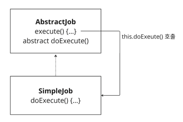

-----

본 글 상단에서 던진 질문 중에 _"Job이 실제로 어떻게 실행되는가?"_ 라는 질문이 있었다.  
우리는 3.1절을 통해 **Job이 정의되는 방식**, **JobLauncher가 Job을 실행하는 방법**, **실행된 Job의 구조**를 알아보았고, 답을 할 수 있을 것같다.  

다음은 이렇게 실행한 Job 즉, JobExecution을 어떻게 관리하고 영속화 시키는지 알아보자.  

## 3.2 JobRepository의 역할과 데이터 관리

앞서 3.1.2.4절에서 살펴보기를, SimpleJobLauncher::run() 내부에서는 `this.jobRepository.createJobExecution()` 메서드르르 호출하여 새로운 JobExecution을 생성한것을 확인했었다.  
그리고, 3.1.2.7에서 AbstractJob::execute() 내부에서는 `this.jobRepository.update(execution)` 메서드를 이용해서, JobExecution의 데이터를 저장(수정)하는 것을 확인했다.  
즉, 위 두 행위로 알 수 있듯이 배치작업과 관련된 정보들을 저장하는 역할을 한다. Spring Batch Meta-Data(JobInstance, JobExecution, StepExecution 등)를 저장한다.  

JobLauncher::run()이나 AbstractJob::execute()에서 간간히 보였다. 다시한번 살펴보면 아래와 같은 역할을 하면서, JobExecution의 상태를 관리하고 있던 것이다.  

#### 3.2.1 SimpleJobLauncher::run()에서 사용했던 JobRepository 메서드

- `jobRepository.getLastJobExecution(String jobName, JobParameters jobParameters)`(3.1.2.3절)
  - 현재 Job의 실행 히스토리 중, 가장 최근 JobExecution 조회
- `jobRepository.createJobExecution(String jobName, JobParameters jobParameters)`(3.1.2.4절)
  - 현재 Job에 대한 새로운 JobExecution을 생성

#### 3.2.2 AbstractJob::execute()에서 사용했던 JobRepository 메서드
- `jobRepository.update(JobExecution jobExecution)`(3.1.2.7절)
    - JobExecution 상태를 업데이트

이 외에도 JobRepository는 다양한 메서드를 제공하며, DB 영속화/조회 역할을 담당한다.  

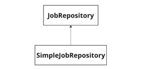

SimpleJobRepository는 Spring Batch에서 제공하는 기본 JobRepository 구현체다. 이 구현체는 배치 메타데이터를 데이터베이스에 저장하고 관리합니다.

### 3.2.3 SimpleJobRepository가 default로 등록되는 원리

JobRepository를 따로 커스텀하게 구현하지 않는다면, 기본적으로 SimpleJobRepository를 사용하는데 구체적으로 어떻게 Bean에 등록되는지 파악해보자.  

#### 3.2.3.1 Spring Batch에는 DefaultBatchConfiguration가 있다. 

DefaultBatchConfiguration는 Spring Batch 환경을 설정하는 기본 설정 클래스다. 이 곳에서 JobRepository를 Bean으로 등록하는데, 코드는 아래와 같다.  

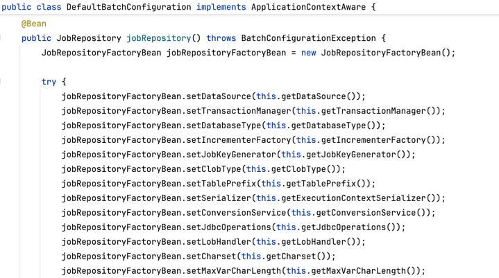

JobRepository를 Bean으로 등록하는 메서드다. `JobRepositoryFactoryBean`인데, 말그대로 JobRepository 생성 팩토리다.  
이 메서드의 반환을 보면 아래와 같다.  

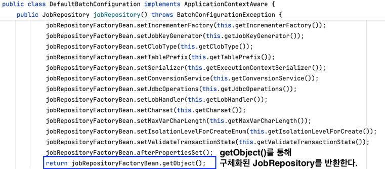

JobRepositoryFactoryBean::getObject()를 통해 구체화된 JobRepository를 반환하면서 Bean으로 등록한다. 이때 이 "구체화된 JobRepository"가 `SimpleJobRepository`다.
아래 이미지를 보자.  

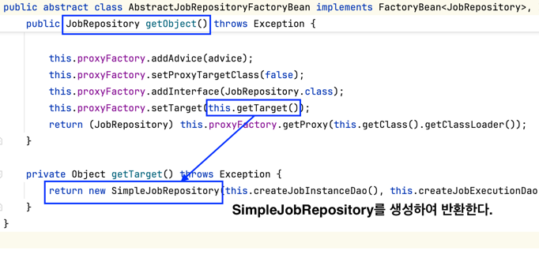

JobRepositoryFactoryBean::getObject() 메서드를 호출하면 위 코드가 호출된다. AbstractJobRepositoryFactoryBean는 JobRepositoryFactoryBean가 구현하고 있는 추상 클래스다.  
내부적으로 SimpleJobRepository를 생성하여 반환하는 것을 확인할 수 있다.  


## 3.3 정리 (JobLauncher & Job & JobRepository의 상호작용 이해)


본 글에서는 위 다이어그램의 각 컴포넌트에 대해 코드 수준에서 살펴봤다.  
각 컴포넌트를 정리하면 아래와 같다.  

1. Job  
JobBuilder를 통해 정의한 Job을 생성한다.  
JobBuilder에 넘기는 타입에 따라 Job 타입이 결정되며, JobBuilder는 Job 생성의 역할을 각 타입의 JobBuilder(e.g. SimpleJobBuilder, FlowJobBuilder)에게 위임한다.  

2. JobLauncher
Job을 실행시키는 run()메서드를 정의해놓은 함수형 인터페이스다. deprecated 될(or 된) SimpleJobLauncher::run(Job job, JobParameters jobParameters)가 호출된다.  
Job을 실행시키기 전과 후에 다양한 기능을 수행한다. **수행할 Job과 JobParameters에 대한 검증**, **JobExecution 생성** 등의 기능을 수행한다.
Job을 본격적으로 실행하기 위해 Job::execute()를 호출한다.  

3. JobRepository  
JobLauncher나 Job에서 JobRepository를 통해 데이터 관리가 이루어지므로 어디에서든 의존 관계가 형성된다. 
배치 작업과 관련된 메타데이터를 관리하고 조회하기 위해 사용되는 인터페이스다.  

----


