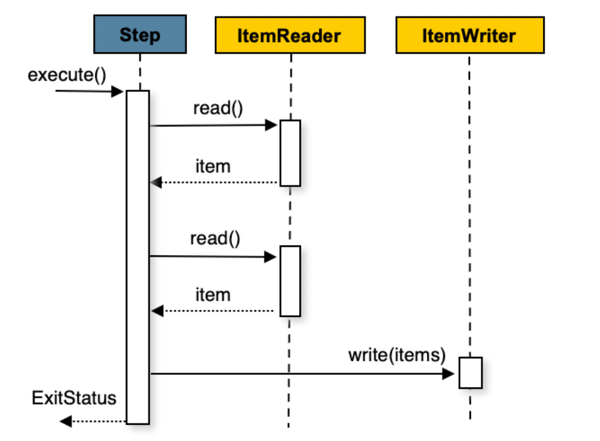
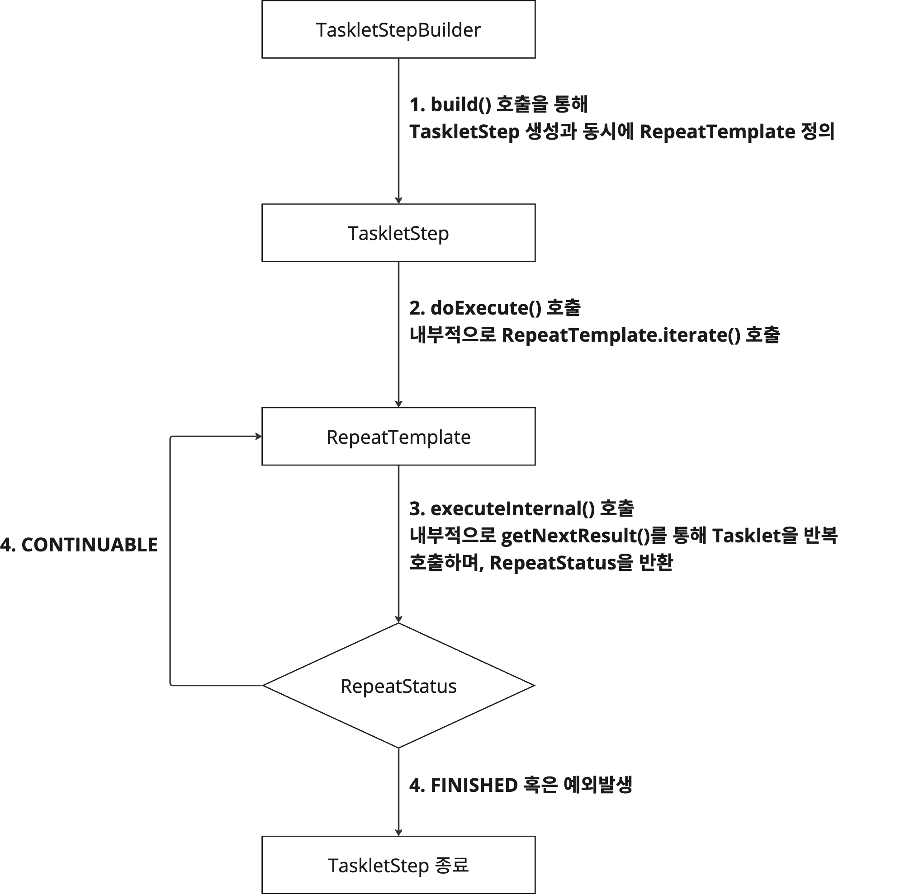

# 5. Tasklet과 TaskletStep 

[이전 글](../batch04/README.md)에서 Step에 대해 다뤘다. 
Step의 생성과 실행 방식에 대해 알아보면서, Step의 종류에 대해서도 간략하게 설명했었다.   

그리고, 앞선 글들에서 모두 Step을 정의할 때, `StepBuilder.tasklet()`을 사용해서 `taskletStep`을 생성했었다. 
이 글에서 taskletStep이 무엇이고, 언제 사용하는지 정리할 것이다.  

그런데, 이 글에서 Tasklet을 별도로 다루는 이유는 뭘까?

SpringBatch에서 Step에 작업을 정의하고 실행하는 일반적인 방법은 두 가지가 있다. 
바로 **Chunk-oriented processing**와 **TaskletStep**이다. Chunk-oriented processing 즉, 청크 지향 처리에 대해 간략하게 설명해보면서 왜 taskletStep이 탄생했는지 알아보고자 한다.  

---

## 5.1 청크 지향 처리(Chunk-oriented processing) 간단 이해

청크 지향 처리는 스프링 배치에서의 가장 일반적인 구현 방식이다.  


이 처리 방식은 하나의 step을 내부적으로 세 단계 분류한다. ItemReader(_데이터 "읽기"_), ItemProcessor(_데이터 "가공 및 사용"_), ItemWriter(_데이터 "쓰기(저장/업데이트 등)"_)로 나눈다.  

무엇보다 중요한 특징은 이 세 단계가 하나의 Step이 내부적으로 **처리하는 방식**인 것이다. 그리고, 이 작업의 **처리 단위**가 바로 **chunk**라는 것이다.   
쉽게 설명하면, 대용량 데이터를 하나의 트랜잭션에서 한 번에 처리하는 것이 아닌, 청크 단위로 쪼개어서 트랜잭션을 분리해서 처리하는 것이다. 
예를 들어 chunk 값을 50으로 처리하면, 데이터를 50개씩 step이 처리된다고 이해하면 된다. 이때의 step이 위에서 말한 세 단계를 거치게 되는 것이다.

이 정도로만 이해하고, 자세한 청크 지향 처리에 대한 내용은 [다음 글](../batch08/README.md)에 정리했다.   

---

## 5.2 Tasklet이란

Tasklet은 **한 Step 내부에서 단일 작업을 수행하기 위한 것**이다. chunk에서의 Step이 세 단계로 분류된거와 달리 각 Step은 정의된 **하나의 작업**만 수행한다.  

만약, 청크 지향 처리만이 Step을 구성하는 유일한 방식이었다면 어땠을까??   

예를 들어, 단순히 데이터베이스의 프로시저를 호출해야하는 배치 작업이 있다고 가정해보자. ItemReader에서 프로시저를 호출한다고 하면, 그 이후 과정은 전혀 필요가 없다. 
즉, 뒤이어 나와야할 ItemProcessor나 ItemWriter가 필요 없는 것이다.  
스프링 배치에서는 이러한 상황에서 아무런 동작을 하지 않는(no-op) 단계가 있는 것이 불필요하다고 판단했고, 이러한 시나리오를 위해 TaskletStep을 제공한다.  

그럼, 이제 TaskletStep과 Tasklet의 관계에 대해 알아보면서, 어떤 원리로 실행되는지 실행방식에 대해 살펴보자.    

---

## 5.3 Tasklet-TaskletStep의 관계와 Tasklet 실행 방식

결국, TaskletStep은 Step의 구현체이자 Tasklet을 실행시키는 객체라고 정의할 수 있다.

이전 글에서 설명한 StepBuilder 메서드들 중, TaskletStepBuilder를 생성하는 tasklet() 메서드를 확인해보자.  
```java
public TaskletStepBuilder tasklet(Tasklet tasklet, PlatformTransactionManager transactionManager) {
    return (new TaskletStepBuilder(this)).tasklet(tasklet, transactionManager);
}
```

taskletStep을 만들기 위한 TaskletStepBuilder를 만드는 메서드인데, 첫번째 인자로 `Tasklet` 타입을 받는다. 
즉, 하나의 정의된 Tasklet을 인자로 받는 것인데, Tasklet 인터페이스를 한번 살펴보자.  


```java
@FunctionalInterface
public interface Tasklet {
    @Nullable
    RepeatStatus execute(StepContribution contribution, ChunkContext chunkContext) throws Exception;
}
```
`Tasklet`은 함수형 인터페이스로, `execute()` 메서드를 하나 정의하고 있다. 그리고, **이 메서드를 실행하는 책임은 `TaskletStep`이 가진다.**

`execute()` 메서드의 반환 타입은 `RepeatStatus` 라는 enum으로 아래와 같이 값이 정의되어 있다.  

```java
public enum RepeatStatus {
    CONTINUABLE(true),
    FINISHED(false);

    private final boolean continuable;
}
```
`FINISHED`는 Tasklet 종료를 의미하고, `CONTINUABLE`는 Tasklet을 반복해야 함을 의미한다. 
**즉, `Tasklet::execute()`가 종료되는 시점에 `FINISHED`를 반환하거나 실패 예외가 발생하기 전까지는 TaskletStep이 while문 안에서 반복적으로 호출하는 구조다.**  

---

## 5.4 Tasklet 실행 과정 분석

지난 글에 걸쳐 계속 사용 중인 아래 예제 코드를 보자.  

```java
@Slf4j
@Configuration
@RequiredArgsConstructor
public class TransferNewUserJobConfiguration {

    private final JobRepository jobRepository;
    private final PlatformTransactionManager platformTransactionManager;
    private static final String JOB_NAME = "TRANSFER_NEW_USER_JOB";
    private static final String STEP_1_NAME = "TRANSFER_NEW_USER_STEP";

    private final UserService userService;

    @Bean
    public Job transferNewUserJob() {
        return new JobBuilder(JOB_NAME, jobRepository)
            .start(transferNewUserStep(null))
            .build();
    }


    @Bean
    @JobScope
    public Step transferNewUserStep(
        @Value("#{jobParameters['targetDate']}") LocalDate targetDate
    ) {
        return new StepBuilder(STEP_1_NAME, jobRepository)
            .tasklet((contribution, chunkContext) -> {
                final List<User> users = userService.findByRegisteredDate(targetDate);
                log.info("{} 명의 유저 정보를 AML 등의 서비스로 전송", users.size());
                return RepeatStatus.FINISHED;
            }, platformTransactionManager)
            .build();
    }
}
```

`transferNewUserStep()`을 통해 taskletStep을 정의하고 있는데, tasklet() 내부에 람다식으로 정의한 것이 Tasklet.execute()를 구현한 것이다. 
이 정의한 taskletStep이 내부적으로 어떻게 실행되는지 이번 글에서 이해해보자.  

<br>

### 5.4.1 TaskletStep

```java
public class TaskletStep extends AbstractStep {

    private RepeatOperations stepOperations;
    private Tasklet tasklet;
    
    // ...

    public TaskletStep(String name) {
        super(name);
        this.stepOperations = new RepeatTemplate();
        this.chunkListener = new CompositeChunkListener();
        this.interruptionPolicy = new ThreadStepInterruptionPolicy();
        this.stream = new CompositeItemStream();
        this.transactionAttribute = new DefaultTransactionAttribute() {
            public boolean rollbackOn(Throwable ex) {
                return true;
            }
        };
    }
    
    public void setStepOperations(RepeatOperations stepOperations) {
        this.stepOperations = stepOperations;
    }

    protected void doExecute(StepExecution stepExecution) throws Exception {
        stepExecution.getExecutionContext()
            .put("batch.taskletType", this.tasklet.getClass().getName());
        stepExecution.getExecutionContext().put("batch.stepType", this.getClass().getName());
        this.stream.update(stepExecution.getExecutionContext());
        this.getJobRepository().updateExecutionContext(stepExecution);
        final Semaphore semaphore = this.createSemaphore();
        this.stepOperations.iterate(new StepContextRepeatCallback(stepExecution) {
            public RepeatStatus doInChunkContext(
                RepeatContext repeatContext,
                ChunkContext chunkContext
            ) throws Exception {
                StepExecution stepExecution = chunkContext.getStepContext().getStepExecution();
                TaskletStep.this.interruptionPolicy.checkInterrupted(stepExecution);

                RepeatStatus result;
                try {
                    result = (RepeatStatus) (new TransactionTemplate(
                        TaskletStep.this.transactionManager,
                        TaskletStep.this.transactionAttribute)).execute(
                        TaskletStep.this.new ChunkTransactionCallback(chunkContext, semaphore));
                } catch (UncheckedTransactionException var6) {
                    UncheckedTransactionException e = var6;
                    throw (Exception) e.getCause();
                }

                TaskletStep.this.chunkListener.afterChunk(chunkContext);
                TaskletStep.this.interruptionPolicy.checkInterrupted(stepExecution);
                return result == null ? RepeatStatus.FINISHED : result;
            }
        });
    }
}
```

위 `TaskletStep::doExecute()` 메서드에서 `Tasklet::execute()`를 실행한다.  

`this.stepOperations.iterate()`가 Tasklet을 반복 실행하는 역할을 담당한다. 
생성자를 잘 보면, **stepOperations의 실제 구현체는 `RepeatTemplate` 타입**이다. 그렇다면, 이 `RepeatTemplate` 타입은 무엇일까?? 알아보자.   
_(참고로 `TaskletStep(String name)` 생성자와 `setStepOperations()` 메서드는 AbstractTaskletStepBuilder.build()에서 TaskletStep을 생성할 때 호출된다.)_


<br>

### 5.4.2 RepeatTemplate

```java
public class RepeatTemplate implements RepeatOperations {

    private CompletionPolicy completionPolicy = new DefaultResultCompletionPolicy();
    
    public RepeatStatus iterate(RepeatCallback callback) {
        RepeatContext outer = RepeatSynchronizationManager.getContext();
        RepeatStatus result = RepeatStatus.CONTINUABLE;

        try {
            result = this.executeInternal(callback); // 1. callback 로직을 그대로 전달
        } finally {
            RepeatSynchronizationManager.clear();
            if (outer != null) {
                RepeatSynchronizationManager.register(outer);
            }

        }

        return result;
    }

    private RepeatStatus executeInternal(final RepeatCallback callback) {
        boolean running = !this.isMarkedComplete(context); // 2. CONTINUABLE

        while(running) {
            // ...
            if (running) { // 2. RepeatStatus가 CONTINUABLE인 경우 true
                
                result = this.getNextResult(context, callback, state);
                this.executeAfterInterceptors(context, result);
                
                // ...
                // 5. Tasklet 실행 후, result 결과가 CONTINUABLE이 아닌 경우, 반복문 종료
                if (this.isComplete(context, result) || this.isMarkedComplete(context) || !deferred.isEmpty()) {
                    running = false;
                }
            }
        }
        // ...
        return result;
    }

    protected RepeatStatus getNextResult(RepeatContext context, RepeatCallback callback, RepeatInternalState state) throws Throwable {
        this.update(context);
        if (this.logger.isDebugEnabled()) {
            this.logger.debug("Repeat operation about to start at count=" + context.getStartedCount());
        }
        return callback.doInIteration(context); // 4. TaskletStep::doExecute()에서 익명 내부 클래스로 정의한 doInChunkContext() 메서드 호출
    }

    
    protected boolean isComplete(RepeatContext context, RepeatStatus result) {
        // 6. 여기서, completionPolicy의 구현체 타입은 DefaultResultCompletionPolicy으로, RepeatStatus.CONTINUABLE이 아닌 경우 true 리턴
        boolean complete = this.completionPolicy.isComplete(context, result); 
        if (complete) {
            this.logger.debug("Repeat is complete according to policy and result value.");
        }

        return complete;
    }
}
```

1. iterate()는 인자로 전달받은 `RepeatCallback` 타입의 값을 `executeInternal()`으로 전달한다.

2. `executeInternal()`는 running 값을 조건으로 하여 현재 실행 상태가 완료상태인지 확인한다.(`RepeatStatus.CONTINUABLE`이면 true 반환)

3. 완료 상태가 아니라면, `getNextResult()` 메서드를 호출한다. 

4. `getNextResult()` 메서드는 내부적으로 `RepeatCallback::doInIteration()`메서드를 호출한다. 
이때, `callback` 파라미터에는 TaskletStep::doExecute()에서 RepeatTemplate::iterate()를 호출할 때, 정의한 구현체 인스턴스가 인자로 넘어온다. **즉, `StepContextRepeatCallback`타입의 callback 인자가 넘어온다.** 
그리고, `TaskletStep::doExecute()` 내부에서 익명 내부 클래스로 정의한 `doInChunkContext()` 로직이 호출된다.  

5. 그리고, Tasklet을 호출한 결과를 반환하는 것이다. 즉, `getNextResult()` 반환 결과가 `RepeatStatus.CONTINUABLE`이 아닌 경우 반복문이 종료된다.  

6. completionPolicy은 `CompletionPolicy` 인터페이스 타입의 필드다. 이는 배치 처리의 완료 여부를 반환하는 정책을 정의한 인터페이스다. 
디폴트 타입은 `DefaultResultCompletionPolicy`이고, 내부 구현 로직은 아래와 같다.  

    ```java
    public class DefaultResultCompletionPolicy extends CompletionPolicySupport {
    
        public boolean isComplete(RepeatContext context, RepeatStatus result) {
            return result == null || !result.isContinuable(); // isContinuable() => (return this == CONTINUABLE;)
        }
    }
    ```
   Tasklet 실행 결과가 `CONTINUABLE`이 아닌 경우에 true를 리턴한다.
    

<br>

### 5.4.3 TaskletStep의 Tasklet 실행 호출 흐름



