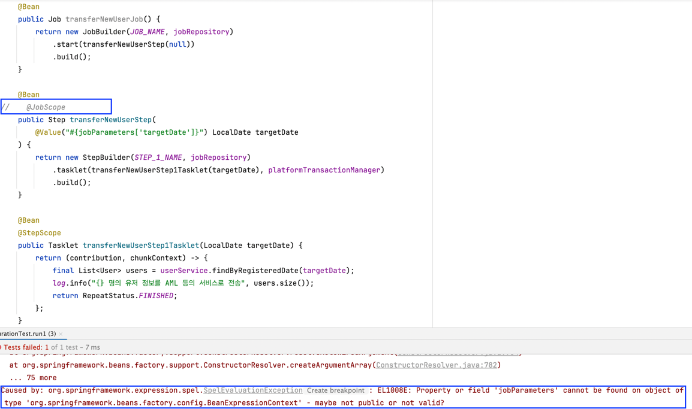

# 7. Scope - Job Scope & Step Scope (w. 지연 바인딩)


[JobParamters를 설명하는 글](../batch02/README.md)에서 `JobParameters`를 사용하면서, `@JobScope`라는 애노테이션을 붙여 사용했었다.  
Spring Batch에는 Scope라는 개념이 존재하는데, 이 개념에 대해 이번 글에서 다룬다.  


## 7.1 JobScope & StepScoe

`@JobScope`와 `@StepScope`는 스프링 배치에서 사용하는 특별한 Bean Scope다. 
즉, 이름에 맞게 `@JobScope`는 배치 작업의 Job 단위로 빈의 생명주기를 관리하는 스코프이고, `@StepScope` 배치 작업의 Step 단위로 빈의 생명주기를 관리하는 스코프이다.  

좀 더 자세히 설명하면 `@JobScope`는 `JobExecutionContext`에서 사용 가능하고, `@StepScope`는 `StepExecutionContext`에서 사용 가능한 Bean Scope다.
(`JobExecutionContext`, `StepExecutionContext`에 대한 자세한 설명은 [여기서](메타데이터) 확인 가능하다. 각각 Job 실행 전체에 대한 컨텍스트, Step 실행에 대한 컨텍스트라고 이해하면 된다.)

때문에 Job의 고정 컴포넌트인 Step을 선언할 때는 `@JobScope`를, Step 내부 컴포넌트인 Tasklet, Reader 등을 선언할 때는 `@StepScope`를 사용한다.
또한, `@JobScope`와 `@StepScope`는 배치에서 지원하는 Bean Scope이고, 이를 붙임으로써 **Job이나 Step이 실행되는 시점에 빈이 등록**된다.

Step을 정의하는 예시 코드를 살펴보자.  

```java
@Slf4j
@Configuration
@RequiredArgsConstructor
public class TransferNewUserJobConfiguration {

    private final JobRepository jobRepository;
    private final PlatformTransactionManager platformTransactionManager;
    private static final String JOB_NAME = "TRANSFER_NEW_USER_JOB";
    private static final String STEP_1_NAME = "TRANSFER_NEW_USER_STEP";

    private final UserService userService;

    @Bean
    public Job transferNewUserJob() {
        return new JobBuilder(JOB_NAME, jobRepository)
            .start(transferNewUserStep(null))
            .build();
    }

    @Bean
    @JobScope
    public Step transferNewUserStep(
        @Value("#{jobParameters['targetDate']}") LocalDate targetDate
    ) {
        return new StepBuilder(STEP_1_NAME, jobRepository)
            .tasklet(transferNewUserStep1Tasklet(targetDate), platformTransactionManager)
            .build();
    }

    @Bean
    @StepScope
    public Tasklet transferNewUserStep1Tasklet(LocalDate targetDate) {
        return (contribution, chunkContext) -> {
            final List<User> users = userService.findByRegisteredDate(targetDate);
            log.info("{} 명의 유저 정보를 AML 등의 서비스로 전송", users.size());
            return RepeatStatus.FINISHED;
        };
    }
}
```

Step을 선언할 때는 `@JobScope`를, Tasklet을 선언할 때는 `@StepScope`을 붙임으로써 빈 등록 시점을 런타임으로 미루고 있다.  


만약, 위 코드에서 JobScope를 안붙인다면 어떻게 될까??  
`@Bean`으로 등록했기 때문에, Spring 컨텍스트 초기화 시점에 빈으로 등록될 것이다.  

위 코드를 한번 실행시켜보자. ([Batch 실행 테스트 참고](../SETUP_BATCH_TEST.md))
실행해보면 아래와 같은 에러가 발생할 것이다.  



관련된 스택 트레이스를 살펴보면, 아래와 같다.  
`EL1008E: Property or field 'jobParameters' cannot be found`

이는 SpEL 표현식(#{jobParameters['key']})에서 jobParameters를 찾지 못했음을 의미하는데, 스프링 빈이 초기화될 때 jobParameters을 못찾은 것이다.  
이유가 뭘까?? 아래 절에서 살펴보자.  


## 7.2 JobParameters는 BeanScope와 함께 

`JobParameters`는 Job 실행 시, JobLauncher를 통해 외부로부터 전달되는 파라미터다. 
즉, `JobParameters`는 Job과 Step이 실행될 때, 필요한 데이터를 사용할 수 있도록 하는 런타임 데이터인 셈이다. 
JobParameters를 어떻게 사용했는지 잘 살펴보면, SpEL을 통해 값을 가져오고 있다. 
SpEL은 런타임 시점에 컨텍스트에서 값을 조작할 수 있는 표현식 언어이다.  

다시 7.1 예제에서 왜 에러가 발생했는지 생각해보면, **`@JobScope`를 없앤다는 것은 Spring 컨텍스트 초기화 시점에 `transferNewUserStep`를 빈으로 등록한다는 의미가 된다.**  
하지만, **해당 시점에는 jobParameters가 존재하지 않으므로 에러가 발생하는 것**이다.  


정리하면 JobParameter의 Lazy Initialization를 통해, 런타임 시점에 `JobExecution` 내부 래핑된 JobParameters에서 값을 검색하고 가져오도록 하는 것이다.  


