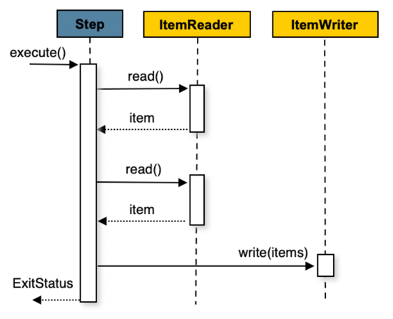
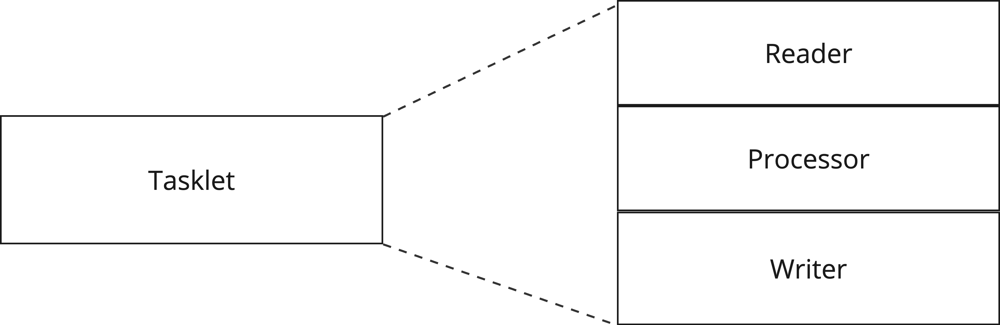

# 8. Chunk 지향 처리 방식의 기본구성과 아키텍처 

배치 작업은 대량의 데이터를 처리한다는 특징을 가진다. Spring Batch에서는 이를 "청크"라는 단위로 트랜잭션 경계를 나누어 처리할 수 있다. 
가장 일반적으로 청크 기반 처리를 구현한다.  

한 번에 전체 데이터를 로드하는게 아닌, 지정된 청크 크기만큼의 데이터를 커밋/롤백할 수 있다. 또한, 데이터를 나누어 처리하므로 병렬 처리하도록 하여 성능을 극대화 시킬 수도 있다.  


## 8.1 단순 Tasklet 구현과 ChunkOrientedTasklet의 차이

Chunk는 한 트랜잭션에서 처리될 데이터 덩어리를 의미한다. 구체적으로 알아보기 위해, 아래 청크 지향 처리 다이어그램을 살펴보자.  



정의한 작업이 실행되면 데이터를 Chunk 수만큼 읽어온다. 이때, 하나씩 읽어오는 것을 알 수 있다. 즉, 데이터를 Chunk 수만큼 반복해서 하나씩 읽어오는 것이다.  
그리고, 하나의 Chunk(읽어들인 데이터 덩어리)를 한번에 데이터를 저장한다. 

이를 슈도코드로 나타내면 아래와 같다.  

```
List items = new Arraylist();
for(int i = 0; i < commitInterval; i++){
    Object item = itemReader.read();
    if (item != null) {
        items.add(item);
    }
}
itemWriter.write(items);
```

단순히 Tasklet::execute()를 구현한 방식과는 다르게 Chunk라는 개념이 사용된 것이다.  
Tasklet::execute()를 통해 단일 태스크를 정의하는 것은 `RepeatStatus`을 사용해서 Tasklet을 반복적으로 수행해왔다.  

반면에, 청크 기반 작업은 Tasklet 인터페이스를 단순히 구현하는 것이 아니라 `ChunkOrientedTasklet`라는 객체로 청크 기반 작업을 수행한다.
`ChunkOrientedTasklet`는 어떻게 다른지 아래 그림으로 살펴보자.  

- **Tasklet::execute() 직접 구현**

    <br>
    

<br>

- **ChunkOrientedTasklet**

  

어쨌든 둘 다 Tasklet::execute()를 구현한 것이며, 차이점은 구현방식의 차이다.
Tasklet::execute()를 직접 커스텀하게 구현한다면 단일 태스크로 구현된다.  
반면에, Chunk 지향 처리를 위한 `ChunkOrientedTasklet`은 Reader & Processor & Writer 묶음으로 하나의 Tasklet을 정의한다.  
커스텀한 Tasklet 구현은 Chunk 단위의 트랜잭션 관리가 필요 없거나 하는 경우에 보통 사용된다. 

이제부터 `ChunkOrientedTasklet`가 어떻게 태스크 수행을 하는지 알아보자.

---

## 8.2 Chunk 지향 처리의 기본 구성

Chunk 지향 처리를 위해, Job을 어떻게 구성하는지 예시를 통해 알아보자.  

```java
public class TransferNewUserJobConfiguration {

    // 1. Job 정의
    @Bean
    public Job transferNewUserJob() {
        return new JobBuilder("TRANSFER_NEW_USER_JOB", jobRepository)
            .start(transferNewUserStep(null))
            .build();
    }

    // 2. Step 정의 (Chunk 지향 Step 구성: Reader/Processor/Writer)
    @Bean
    @JobScope
    public Step transferNewUserStep(
        @Value("#{jobParameters['targetDate']}") LocalDate targetDate
    ) {
        return new StepBuilder("TRANSFER_NEW_USER_STEP", jobRepository)
            .<User, User>chunk(CHUNK_SIZE, platformTransactionManager)
            .reader(reader())
            .processor(processor(null))
            .writer(writer())
            .build();
    }

    // 3. Reader 정의
    @Bean
    @StepScope
    public JpaPagingItemReader<User> reader() {
        return new JpaPagingItemReaderBuilder<User>()
            .name("TRANSFER_NEW_USER_STEP_READER")
            .entityManagerFactory(entityManagerFactory)
            .queryString("""
                SELECT u
                FROM User u
                """)
            .pageSize(CHUNK_SIZE)
            .build();
    }

    // 4. Processor 정의
    @Bean
    @StepScope
    public ItemProcessor<User, User> processor(
        @Value("#{jobParameters['targetDate']}") final LocalDate targetDate
    ) {
        return new FunctionItemProcessor<>(user -> {
            if (user.getRegisteredAt().toLocalDate().isEqual(targetDate)) {
                return user;
            }
            return null;
        });
    }

    // 5. Writer 정의
    @Bean
    @StepScope
    public ItemWriter<User> writer() {
        return chunk -> chunk.getItems().forEach(user ->
            log.info("DB에 유저 정보 저장 =>  id: {}, name: {}", user.getId(), user.getName())
        );
    }
}
```

1. Job을 정의한다. Job은 Step으로 구성된다는 것은 변함없다.
2. Step을 정의한다. Step을 정의할 때, StepBuilder의 Chunk 지향 처리를 위해 `chunk()`메서드를 호출한다. 
그리고, Chunk 지향 처리답게 Reader, Processor, Writer로 Step의 단계를 구분지어 정의했다.  
StepBuilder::chunk() 메서드는 다음 절에서 살펴보자.
3. `Reader`는 데이터를 읽는 역할을 하고, 여기서는 ItemReader의 구현체인 `JpaPagingItemReader`를 사용하고 있다. 
입력 타입을 `User`로 정의했다. 이 입력 타입은 Processor로 넘어가게 된다.
4. `Processor`는 입력 데이터를 받아서, 출력 데이터로 변환한다. 
여기서는 User 타입을 받아, User를 그대로 반환하는 의미로 `ItemProcessor<User, User>`라고 반환타입을 명시했다. 
5. `Writer`는 Processor로부터 가공된 User타입의 데이터들을 chunk 단위로 받아서, 한번에 DB에 쓰기 작업을 수행한다. 

`ItemReader`, `ItemProcessor`, `ItemWriter`의 동작 방식에 대해서는 별도로 글로 알아보고,
여기서는 `StepBuilder`의 `chunk()`메서드의 동작 방식에 대해서만 알아보자.  


---

## 8.3 ChunkOrientedTasklet의 생성 방식(w. StepBuilder::chunk())

8.2에서 보았듯이 청크 지향 방식의 Step 생성을 위해서 StepBuilder의 chunk() 메서드를 호출했다.  
이 메서드 호출을 통해 `ChunkOrientedTasklet`을 생성할 수 있는데, 한번 메서드를 살펴보자.  

```java
public class StepBuilder extends StepBuilderHelper<StepBuilder> {
    
    // SimpleStepBuilder를 반환
    public <I, O> SimpleStepBuilder<I, O> chunk(int chunkSize, PlatformTransactionManager transactionManager) {
        return ((SimpleStepBuilder)(new SimpleStepBuilder(this)).transactionManager(transactionManager)).chunk(chunkSize);
    }
}
```

`chunk()` 메서드는 `SimpleStepBuilder`를 반환한다. 이는 `TaskletStep`을 생성해주는 `bulid()`메서드를 가지고 있다. 
앞서, Tasklet::execute()를 구현하는 [단일 태스크 방식](../batch5/README.md)에서도 `Tasklet`을 생성하긴 했다. 
하지만 이때는 `StepBuilder::tasklet()` 호출을 통해 `TaskletStepBuilder`를 반환받은 반면, `StepBuilder::chunk()`을 통해 `SimpleStepBuilder`을 반환받는다.  

`SimpleStepBuilder`의 내부 구조를 보면서 어떻게 `ChunkOrientedTasklet`이 생성되는지 확인해보자.  

```java
public class SimpleStepBuilder<I, O> extends AbstractTaskletStepBuilder<SimpleStepBuilder<I, O>> {
    private ItemReader<? extends I> reader;
    private ItemWriter<? super O> writer;
    private ItemProcessor<? super I, ? extends O> processor;

    public TaskletStep build() {
        this.registerStepListenerAsItemListener();
        this.registerAsStreamsAndListeners(this.reader, this.processor, this.writer);
        return super.build();
    }

    protected Tasklet createTasklet() {
        Assert.state(this.reader != null, "ItemReader must be provided");
        Assert.state(this.writer != null, "ItemWriter must be provided");
        RepeatOperations repeatOperations = this.createChunkOperations();
        SimpleChunkProvider<I> chunkProvider = new SimpleChunkProvider(this.getReader(), repeatOperations);
        SimpleChunkProcessor<I, O> chunkProcessor = new SimpleChunkProcessor(this.getProcessor(), this.getWriter());
        chunkProvider.setListeners(new ArrayList(this.itemListeners));
        chunkProvider.setMeterRegistry(this.meterRegistry);
        chunkProcessor.setListeners(new ArrayList(this.itemListeners));
        chunkProcessor.setMeterRegistry(this.meterRegistry);
        ChunkOrientedTasklet<I> tasklet = new ChunkOrientedTasklet(chunkProvider, chunkProcessor);
        tasklet.setBuffering(!this.readerTransactionalQueue);
        return tasklet;
    }

    public SimpleStepBuilder<I, O> reader(ItemReader<? extends I> reader) {
        this.reader = reader;
        return this;
    }

    public SimpleStepBuilder<I, O> writer(ItemWriter<? super O> writer) {
        this.writer = writer;
        return this;
    }

    public SimpleStepBuilder<I, O> processor(ItemProcessor<? super I, ? extends O> processor) {
        this.processor = processor;
        return this;
    }
    
}
```

필요한 메서드들만 가져왔다.  
8.2절에서 Step을 구성할 때, reader(), processor(), writer() 순서로 구성했었다. 그때 호출되는 메서드가 위 메서드들이다.  
그리고 `build()`메서드를 살펴보면, 부모의 `build()`를 호출하는데, 코드로 한번 살펴보자.  

```java
public abstract class AbstractTaskletStepBuilder<B extends AbstractTaskletStepBuilder<B>> extends StepBuilderHelper<B> {
    // ...
    public TaskletStep build() {
        TaskletStep step = new TaskletStep(this.getName());
        
        // ...
        step.setTasklet(this.createTasklet()); // TaskletStep이 실행할 Tasklet 등록
        return step;
    }
}
```

`SimpleStepBuilder`의 부모인 `AbstractTaskletStepBuilder`의 `build()`메서드다. 
내부적으로 TaskletStep을 생성하고 Tasklet을 정의할 때, `createTasklet()` 메서드를 호출한다. 
이 `createTasklet()` 메서드는 SimpleStepBuilder에 구현되어 있는 메서드로, 위 코드를 살펴보면 `ChunkOrientedTasklet`를 생성하는 것을 알 수 있다.  


내부적으로 어떻게 `ChunkOrientedTasklet`을 생성하는지 알아봤지만, 
결국에는 `SimpleStepBuilder`이 TaskletStep을 생성하고, 내부 Tasklet을 청크 지향 처리 방식인 `ChunkOrientedTasklet`으로 생성하는 것이다.   


---

## 8.4 ChunkOrientedTasklet의 실행 방식

`ChunkOrientedTasklet`는 결국 청크 지향 처리에 대한 로직이 정의되어 있는 Tasklet인 셈이다. 
때문에, `Tasklet`을 구현하고 있고, 결국에는 Tasklet::execute()메서드를 구현하고 있을 것이다.([Tasklet 글 참고](../batch5/README.md))  

구현 코드를 직접 보며 알아보자.  

```java
public class ChunkOrientedTasklet<I> implements Tasklet {
    private static final String INPUTS_KEY = "INPUTS";
    private final ChunkProcessor<I> chunkProcessor;
    private final ChunkProvider<I> chunkProvider;
    private boolean buffering = true;

    public ChunkOrientedTasklet(ChunkProvider<I> chunkProvider, ChunkProcessor<I> chunkProcessor) {
        this.chunkProvider = chunkProvider;
        this.chunkProcessor = chunkProcessor;
    }

    public void setBuffering(boolean buffering) {
        this.buffering = buffering;
    }

    @Nullable
    public RepeatStatus execute(StepContribution contribution, ChunkContext chunkContext) throws Exception {
        Chunk<I> inputs = (Chunk)chunkContext.getAttribute("INPUTS");
        if (inputs == null) {
            inputs = this.chunkProvider.provide(contribution); // 1. Reader를 통해 데이터를 읽어드린다.
            if (this.buffering) {
                chunkContext.setAttribute("INPUTS", inputs);
            }
        }

        this.chunkProcessor.process(contribution, inputs); // 2. Processor와 Writer 로직을 처리한다. 
        this.chunkProvider.postProcess(contribution, inputs);
        if (inputs.isBusy()) {
            return RepeatStatus.CONTINUABLE;
        } else {
            chunkContext.removeAttribute("INPUTS");
            chunkContext.setComplete();
            return RepeatStatus.continueIf(!inputs.isEnd());
        }
    }
}
```

위 클래스는 ChunkOrientedTasklet 클래스(Spring Batch 5.1 기준)에서 로깅을 제외한 전체 로직을 전부 가져온 것이다.  
깔끔하게 `execute()` 메서드만 정의되어 있다.  

주석이 달린 `chunkProvider.provide()`와 `chunkProcessor.process()`만 세부적으로 이해하면 충분할 것 같다. 각각 Reader, Processor&Writer 로직을 담당한다.  
그리고 각각 `SimpleChunkProvider` 클래스와 `SimpleChunkProvider`클래스만 구현하고 있다.  

---

### 8.4.1 SimpleChunkProvider

```java
public class SimpleChunkProvider<I> implements ChunkProvider<I> {

    protected final ItemReader<? extends I> itemReader;
    private final RepeatOperations repeatOperations;
    
    public Chunk<I> provide(final StepContribution contribution) throws Exception {
        Chunk<I> inputs = new Chunk(new Object[0]);
        this.repeatOperations.iterate((context) -> { // 반복해서 아이템을 읽음 
            Object item;
            try {
                item = this.read(contribution, inputs); // Reader::read()를 통해 데이터 읽어들임
            } catch (SkipOverflowException var12) {
                status = "FAILURE";
                var8 = RepeatStatus.FINISHED;
            } finally {
                this.stopTimer(sample, contribution.getStepExecution(), status);
            }

            if (item == null) {
                inputs.setEnd();
                return RepeatStatus.FINISHED;
            }
            inputs.add(item); // 리스트에 데이터 추가
            contribution.incrementReadCount();
            return RepeatStatus.CONTINUABLE;
        });
        return inputs;
    }
}

protected I read(StepContribution contribution, Chunk<I> chunk) throws SkipOverflowException, Exception {
    return this.doRead();
}

protected final I doRead() throws Exception {
    
    // ...
    this.listener.beforeRead();
    I item = this.itemReader.read();
    if (item != null) {
        this.listener.afterRead(item);
    }
    return item;
}
```

`provide()` 메서드는 repeatOperations를 통해 반복해서 아이템을 읽어들인다. `RepeatOperations`의 구현체는 `RepeatTemplate`으로 초기화 되어 있다. 
[Tasklet을 설명하는 글](../batch5/README.md)에서 `RepeatTemplate`의 `completionPolicy`필드에 대해 설명한 적이 있다.  

`SimpleChunkProvider`에서 초기화 되어 있는 `RepeatTemplate`의 `CompletionPolicy`는 `SimpleCompletionPolicy` 클래스의 객체가 초기화 되어 있다. 
그리고, SimpleCompletionPolicy가 구현하고 있는 `isComplete()` 메서드는 아래와 같다. 

`read()` 메서드에 대해서는 [ItemReader 챕터](../batch9/README.md)에서 설명하고 있으니 참고하자. 

```java
public class SimpleCompletionPolicy extends DefaultResultCompletionPolicy {
    public boolean isComplete() {
        return this.getStartedCount() >= SimpleCompletionPolicy.this.chunkSize;
    }
}
```

즉, SimpleChunkProvider 내부에 초기화 되어 있는 RepeatTemplate의 CompletePolicy는 `SimpleCompletionPolicy`이며, 
해당 클래스는 Step 생성 시 설정한 chunk size의 값과 같거나 크다면 완료 처리를 한다. 이후에는 더 이상 데이터를 읽어들이지 않는다.  
(RepeatTemplate이나 CompletionPolicy 등과 관련된 개념은 [batch5](../batch5/README.md)에서 정리하고 있다.)

어쨌든, 이렇게 읽어들인 데이터를 `chunkProcessor.process()`로 넘겨 나머지 로직을 수행한다. 


---

### 8.4.2 SimpleChunkProcessor
ChunkOrientedTasklet::execute() 내부에서 `chunkProvider.provide(contribution)`을 통해 inputs 필드에 데이터를 읽어들였다.  
그리고, 읽어드린 데이터를 SimpleChunkProcessor 구현체의 process() 메서드를 통해 넘긴다.  

```java
public class SimpleChunkProcessor<I, O> implements ChunkProcessor<I>, InitializingBean {

    private ItemProcessor<? super I, ? extends O> itemProcessor;
    private ItemWriter<? super O> itemWriter;

    public final void process(StepContribution contribution, Chunk<I> inputs) throws Exception {
        this.initializeUserData(inputs);
        if (!this.isComplete(inputs)) {
            Chunk<O> outputs = this.transform(contribution, inputs); // 1. Processor를 통해 데이터 가공
            contribution.incrementFilterCount((long)this.getFilterCount(inputs, outputs));
            this.write(contribution, inputs, this.getAdjustedOutputs(inputs, outputs)); // 2. Writer를 통해 데이터 쓰기 작업 수행
        }
    }

    protected Chunk<O> transform(StepContribution contribution, Chunk<I> inputs) throws Exception {
        Chunk<O> outputs = new Chunk<>();
        for (Chunk<I>.ChunkIterator iterator = inputs.iterator(); iterator.hasNext();) {
            final I item = iterator.next();
            O output;
            Timer.Sample sample = BatchMetrics.createTimerSample(this.meterRegistry);
            String status = BatchMetrics.STATUS_SUCCESS;
            try {
                output = doProcess(item); // 하나의 데이터를 가공하기 위한 호출 
            }
            catch (Exception e) {
                inputs.clear();
                status = BatchMetrics.STATUS_FAILURE;
                throw e;
            }
            finally {
                stopTimer(sample, contribution.getStepExecution(), "item.process", status, "Item processing");
            }
            
            if (output != null) {
                outputs.add(output);
            }
            else {
                iterator.remove();
            }
        }
        if (inputs.isEnd()) {
            outputs.setEnd();
        }
        return outputs;
    }
    
    protected final O doProcess(I item) throws Exception {
        Object result;
        if (this.itemProcessor == null) {
            result = item;
            return result;
        } else {
            try {
                this.listener.beforeProcess(item);
                result = this.itemProcessor.process(item); // 1. Step 정의할 때, 작성한 process() 로직 호출
                this.listener.afterProcess(item, result);
                return result;
            } catch (Exception var3) {
                Exception e = var3;
                this.listener.onProcessError(item, e);
                throw e;
            }
        }
    }

    protected void write(StepContribution contribution, Chunk<I> inputs, Chunk<O> outputs) throws Exception {
        Timer.Sample sample = BatchMetrics.createTimerSample(this.meterRegistry);
        String status = BatchMetrics.STATUS_SUCCESS;
        try {
            doWrite(outputs);
        }
        catch (Exception e) {
            inputs.clear();
            status = BatchMetrics.STATUS_FAILURE;
            throw e;
        }
        finally {
            stopTimer(sample, contribution.getStepExecution(), "chunk.write", status, "Chunk writing");
        }
        contribution.incrementWriteCount(outputs.size());
    }

    protected final void doWrite(Chunk<O> items) throws Exception {
        // ...
        try {
            listener.beforeWrite(items);
            writeItems(items);
            doAfterWrite(items);
        }
        catch (Exception e) {
            doOnWriteError(e, items);
            throw e;
        }
    }

    protected void writeItems(Chunk<O> items) throws Exception {
        if (itemWriter != null) {
            itemWriter.write(items); // 2. Step 정의할 때, 작성한 write() 로직 호출
        }
    }
}
```

`process()`메서드 호출을 통해 `inputs` 파라미터를 받아, 내부적으로 Processor 로직과 Writer 로직을 수행한다. 각각 `transform()`, `write()` 메서드가 이에 해당한다.  

1. `transform()`
chunk size 만큼 특정 타입의 데이터를 가공해야 한다. `doProcess()`에 단일 데이터를 넘겨, Step을 정의할 때 작성했던 ItemProcessor 로직을 수행한다. 

2. `write()`
transform()을 통해 가공된 데이터를 DB에 쓰기 위해, 호출한다. 이는 반복문을 통해 수행되는게 아닌 가공된 데이터 리스트(`Chunk<O> items`)를 한번에 쓴다.  


----

이번 글에서는 `ChunkOrientedTasklet`의 생성과 실행 방식에 대해 알아보았다. 
알아보기에 앞서 Tasklet::execute()를 커스텀하게 정의한 방식과의 차이도 알아보았다.  

