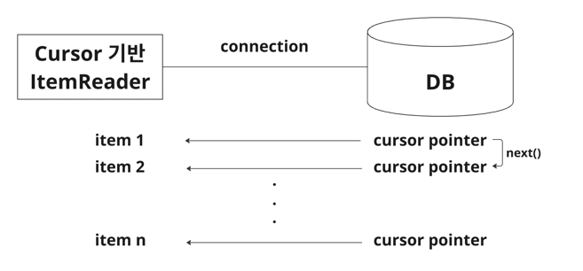

# 9. ItemReader

ChunkOrientedTasklet에 의해 Chunk 처리가 이루어짐을 파악했고, 이는 ItemReader & ItemProcessor & ItemWriter로 구성됨을 알았다. 
본 글에서는 데이터를 읽어들이는 ItemReader에 대해 알아보고자 한다.   

---

## 9.1 ItemReader
`ItemReader`는 인터페이스다. 어딘가로부터 데이터를 읽어들이기 위해 ItemReader를 적절하게 구현할 수 있다는 의미이기도 하다. 
하지만, Spring Batch에서는 다양한 구현체들이 존재하기 때문에 구현체들 위주로 알아보고자 한다.  

그에 앞서, ItemReader 인터페이스와 그 구현체들은 어떻게 관계가 구성되어 있는지 알아보자.  


```java
@FunctionalInterface
public interface ItemReader<T> {
    @Nullable
    T read() throws Exception, UnexpectedInputException, ParseException, NonTransientResourceException;
}
```

위 코드는 `ItemReader` 인터페이스를 그대로 가져온 것이다. 함수형 인터페이스로 `read()` 메서드를 하나 정의하고 있다.  
정말 데이터를 읽어드리는 역할만 수행하고 있는데, 사실 Spring Batch에서 주로 사용되는 ItemReader들(ItemReader의 구현체들)은 ItemReader만을 구현하진 않는다.  

`ItemStream` 이라는 인터페이스도 함께 구현한 `ItemStreamReader`를 사용한다. 어떻게 사용하는 것일까? 살펴보자.  

---

## 9.2 ItemStream

```java
public interface ItemStream {
    default void open(ExecutionContext executionContext) throws ItemStreamException {
    }

    default void update(ExecutionContext executionContext) throws ItemStreamException {
    }

    default void close() throws ItemStreamException {
    }
}
```

`ItemStream` 인터페이스는 이름에서부터 알 수 있듯이 데이터 Stream을 처리하는 과정에서 필요한 기능들을 정의해놓은 인터페이스다. 
예를 들어 데이터를 처리하는 과정의 상태를 저장할 수 있는데, 총 세 가지 기능이 정의되어 있다.  

- `open()`: 데이터에 접근하기 위해 스트림을 여는 역할을 함
- `update()`: 데이터 처리 상황/상태를 저장함
- `close()`: 스트림을 처리하는데 필요한 모든 리소스를 해제 함

잘 보면, 데이터에 접근하기 전과 후에 필요한 설정을 하고 리소스를 확보하는 일을 수행한다. 
이는 `ItemReader`와만 함께 쓰이는 인터페이스가 아니다. 데이터에 접근하는 일은 읽는 작업도 있지만, 쓰기 작업도 있다. 즉, `ItemWriter`도 해당 인터페이스와 조화롭게 사용되곤 한다.   
현재는 ItemReader를 다루고 있으니, Spring Batch에는 ItemReader와 ItemStream을 조합한 어떤 구현체들이 있는지 알아보자.  

---

## 9.3 ItemStreamReader의 구현 방식 - Cursor? Paging?

배치를 띄우고 실행하는 가장 큰 목적은 아마 대용량 처리일 것이다. 대용량 데이터를 한번에 메모리에 로드해서 처리할 수 있다면 그건 배치처리가 굳이 필요 없을 수 있다.  
즉, 배치는 I/O 성능 문제나 메모리 오버플로우를 고려되어야 한다. 
스프링 배치에서는 이를 해결하기 위해 **두 타입의 ItemReader를 기반**으로 한다.  

<br>

### 9.3.1 Cursor 기반 vs Paging 기반
(JDBC의 ResultSet 메커니즘을 그대로 사용하는)Cursor 기반 조회는 데이터를 한번에 메모리에 로드하지 않고, 스트리밍 방식으로 메모리에 올린다. 
즉 Reader 단계에서 DB와 conn을 맺으면, 데이터를 다 로드할 때까지 다음 데이터를 하나씩 가져오는 방식이다. 



<br>

Paging 기반 조회는 페이징 단위로 연결을 맺고 끊는 방식이다. 즉, 하나의 DB connection에 대해 설정한 page size만큼 데이터를 메모리에 로드하는 방식이다. 


---

### 9.3.2 Cursor 기반의 ItemReader

Spring Batch에서 제공하는 많은 ItemReader 구현체들 중, 여기서 알아볼 Cursor 기반인 구현체는 아래와 같이 있다.
- JdbcCursorItemReader
- JpaCursorItemReader


#### 9.3.2.1 JdbcCursorItemReader

우선, `JdbcCursorItemReader`를 사용해서 Reader를 구성한 청크 지향 배치 설정을 코드로 살펴보자.  

```java
@Slf4j
@Configuration
@RequiredArgsConstructor
public class JdbcCursorReaderExampleConfiguration {

    private final JobRepository jobRepository;
    private final PlatformTransactionManager platformTransactionManager;
    private final DataSource dataSource; // DB에 연결하기 위한 Datasource 객체

    private static final int CHUNK_SIZE = 2;

    @Bean
    public Job jdbcCursorReaderJob() {
        return new JobBuilder("jdbcCursorReaderJob", jobRepository)
            .start(jdbcCursorReaderStep())
            .build();
    }

    @Bean
    public Step jdbcCursorReaderStep() {
        return new StepBuilder("jdbcCursorReaderStep", jobRepository)
            .<User, User>chunk(CHUNK_SIZE, platformTransactionManager)
            .reader(reader())
            .writer(writer())
            .build();
    }

    @Bean
    public JdbcCursorItemReader<User> reader() {
        return new JdbcCursorItemReaderBuilder<User>()
            .name("jdbcCursorItemReader")
            .beanRowMapper(User.class) // 쿼리 결과를 인스턴스와 매핑하기 위한 Mapper 객체, 내부적으로 BeanPropertyRowMapper를 사용해서 rowMapper 필드에 설정
            .dataSource(dataSource)
            .fetchSize(CHUNK_SIZE)
            .sql("""
                select id, name
                from user
                """)
            .build();
    }

    @Bean
    public ItemWriter<User> writer() {
        return item -> log.info("User 정보 => {}", item);
    }
}
```

전체적인 코드의 기능은 [이전글](../batch08/README.md)과 동일하다. 여기서는 `reader()` 메서드를 잘 살펴보자.  
`JdbcCursorItemReaderBuilder`를 통해 reader를 생성한다. `JdbcCursorItemReader`를 생성하기 위한 설정값은 무엇이 있을까?  

- `name`: `ExecutionContext`에 상태를 저장하고 관리되기 위한 이름을 지정한다. 
- `beanRowMapper`: `RowMapper`라는 개념은 쿼리 결과를 매핑할 객체를 지정하곤 한다.  
이를 위해 `BeanPropertyRowMapper`을 통해 매핑 클래스를 설정하곤 하는데, `beanRowMapper`는 내부적으로 이를 지정해주기 때문에 매핑할 객만 지정하면 된다.
- `datasource`: DB 연결을 위한 Datasource 객체를 지정한다.
- `fetchSize`: DB에서 가져올 데이터 갯수를 의미한다. Cursor 방식에서는 한 번에 메모리에 로드할 크기를 의미한다.  
즉, ResultSet 객체가 한번에 DB로부터 메모리에 로드할 데이터의 수를 의미하는 것이다.  
- `sql`: 데이터를 읽어들이기 위한 쿼리문 작성
- `qyeryArguments`: 이 예시에서는 생략되었지만, 쿼리문에 주입할 파라미터를 지정한다.

내부적으로 `JdbcCursorItemReaderBuilder`는 어떻게 데이터를 스트리밍 하는 것인가에 대해 알아보자.  

[이전글](../batch08/README.md)에서 ChunkProvider는 Reader 로직을 담당한다고 했었다.  
ChunkProvider에는 `provide()` 메서드가 있다. 그리고, `provide()` 메서드는 내부적으로 `read()` 메서드를 호출한다.  
그 read() 메서드는 아래와 같다.  

<br>

```java
protected I read(StepContribution contribution, Chunk<I> chunk) throws SkipOverflowException, Exception {
    return this.doRead();
}

protected final I doRead() throws Exception {
    
    // ...
    this.listener.beforeRead();
    I item = this.itemReader.read(); // itemReader: JdbcCursorItemReader
    if (item != null) {
        this.listener.afterRead(item);
    }
    return item;
}
```

`doRead()`메서드를 잘 보면 `itemReader.read()`가 호출되고 있는데, itemReader의 구현체가 현재는 `JdbcCursorItemReader`다.  
JdbcCursorItemReader의 read()에서 내부 동작방식을 확인할 수 있을 것 같다.  

```java

public class JdbcCursorItemReader<T> extends AbstractCursorItemReader<T> {

    private PreparedStatement preparedStatement;
    private PreparedStatementSetter preparedStatementSetter;
    private String sql;
    private RowMapper<T> rowMapper;

    @Nullable
    protected T readCursor(ResultSet rs, int currentRow) throws SQLException {
        return this.rowMapper.mapRow(rs, currentRow);
    }
}
```

`JdbcCursorItemReader::read()`를 호출하면 상위 클래스가 호출되고, 결국에는 `JdbcCursorItemReader`의 `readCursor()`메서드가 호출된다.  
`readCursor()`는 내부적으로 `ResultSet`의 `next`를 호출시키면서 커서를 다음 행으로 이동 시켜가며 데이터를 RowMapper에 설정한 객체와 매핑시킨다.  

<br>

<참고>

RowMapper의 `mpaRow()` 기능은 무엇일까?  
```java
@FunctionalInterface
public interface RowMapper<T> {
    @Nullable
    T mapRow(ResultSet rs, int rowNum) throws SQLException;
}
```
jdbc에서 제공하는 RowMapper 인터페이스는 함수형 인터페이스로, `mapRow()`를 가진다. 이는 `ResultSet`을 파라미터로 받아 특정 타입(T)으로 매핑해주는 매퍼 역할을 수행한다.  


<br>

지금까지 위에서 `ChunkProvider::provide()`에서 호출하는 `read()`메서드에 대해 알아본 것이다. 근데 이제 `JdbcCursorItemReader::read()`인.  
그래서, 결국 핵심은 `JdbcCursorItemReader::readCursor()`가 chunk size만큼 DB로부터 데이터를 스트리밍 해오는 것이다. 

위 예제를 실행해보며, 조회 결과를 살펴보자.   

더미 데이터는 아래와 같이 6개를 넣고, chunk size는 2로 지정한 후 실행시켜보자. 


실행 결과는 아래와 같이 3번의 writer 로직이 호출된다. 총 6개의 데이터를 한 번의 read작업에서 fetchSize 만큼 가져오기 때문이다.  


스트리밍 방식으로 데이터를 가져오는 방식이다. 즉, 데이터를 읽어들이는 시점부터 배치가 끝날때까지 하나의 커넥션이 끊기지 않는다.  
다이어그램으로 표현하면 아래와 같다.  


<br>

#### 9.3.2.2 JpaCursorItemReader

`JpaCursorItemReader`는 jpa의 `Query`객체를 사용해서 데이터를 읽어들인다. 
정확히는 `Query.getResultStream()`을 통해 데이터 목록을 조회해오고, 이를 `Stream`으로 변환한다. 
그리고, `Stream.iterator()`을 통해 `Iterator`로 변환한다. 
**여기까지가 `open()` 메서드의 역할**이다. 아래가 JpaCursorItemReader의 open() 메서드다.  
```java
void doOpen() {
    this.entityManager = this.entityManagerFactory.createEntityManager();
    // ...
    Query query = this.createQuery();
    this.iterator = query.getResultStream().iterator();
}
```

이후, read() 메서드가 호출되면 iterator를 통해 데이터를 하나씩 조회해온다. 아래는 read() 메서드다.  
```java
T doRead() {
    return this.iterator.hasNext() ? this.iterator.next() : null;
}
```

즉, jpa에서 제공하는 Query#getResultStream()을 사용한 커서 방식을 이용한 ItemReader라고 이해하면 좋을 듯하다.  

예제코드는 [여기서](/src/main/java/batch9/job/JpaCursorReaderExampleConfiguration.java) 확인 가능하다.

----

### 9.3.3 Paging 기반의 ItemReader

Spring Batch에서 제공하는 많은 ItemReader 구현체들 중, 여기서 알아볼 Paging 기반의 구현체는 아래와 같이 있다.
- JpaPagingItemReader

`JdbcPagingItemReader` 방식도 있지만, 현재 Jpa 기반으로 pagingReader를 구성하고 있어서 `JpaPagingItemReader`만 파악해보려고 한다.
(JdbcPagingItemReader는 JdbcCursorItemReader 방식에서의 JdbcTemplate과 페이징 방식을 조화롭게 사용하고 있지않을까 예측해본다.. 기회가 되면 파악해보기로..)

<br>

#### 9.3.3.1 JpaPagingItemReader

우선, `JpaPagingItemReader`를 사용해서 Reader를 구성한 청크 지향 배치 설정을 코드로 살펴보자.  

```java
@Slf4j
@Configuration
@RequiredArgsConstructor
public class JpaPagingReaderExampleConfiguration {

    private final JobRepository jobRepository;
    private final PlatformTransactionManager platformTransactionManager;
    private final EntityManagerFactory entityManagerFactory;

    private static final int CHUNK_SIZE = 2;

    @Bean
    public Job jpaPagingReaderJob() {
        return new JobBuilder("jpaPagingReaderJob", jobRepository)
            .start(jpaPagingReaderStep())
            .build();
    }

    @Bean
    public Step jpaPagingReaderStep() {
        return new StepBuilder("jpaPagingReaderStep", jobRepository)
            .<User, User>chunk(CHUNK_SIZE, platformTransactionManager)
            .reader(jpaPagingReader())
            .writer(writer())
            .build();
    }

    @Bean
    public JpaPagingItemReader<User> jpaPagingReader() {
        return new JpaPagingItemReaderBuilder<User>()
            .name("jpaPagingItemReader")
            .entityManagerFactory(entityManagerFactory)
            .queryString("select u from User u order by u.id")
            .pageSize(10)
            .build();
    }

    @Bean
    public ItemWriter<User> writer() {
        return item -> log.info("User 정보 => {}", item);
    }
}
```

`JpaPagingItemReaderBuilder`를 사용해 `JpaPagingItemReader`를 생성한다. 설정값을 살펴보자.  

- `name`: `ExecutionContext`에 상태를 저장하고 관리되기 위한 이름을 지정한다. 
- `entityManagerFactory`: EntityManager를 생성하는 팩토리 클래스를 지정
- `queryString`: JPQL 지정
- `pageSize`: 페이징 조회를 위해, 쿼리당 가져올 아이템 갯수를 지정

구조 자체는 `JpaCursorItemReader`와 동일하다. 데이터를 조회하는 방식이 Stream이 아닌 List인 것만 다르다.  
즉 Query#getResultStream()을 통해 stream을 얻는 것이 아닌, Query#getResultList()를 통해 DB 데이터를 페이지 크기만큼 조회하여 메모리에 로드하는 방식이다.   

read() 메서드가 호출되면 아래 메서드가 호출된다. 아래 메서드느 JpaCursorItemReader에 정의된 `doReadPage()` 메서드다.  

```java
void doReadPage() {
        EntityTransaction tx = null;
        // ...
        Query query = this.createQuery().setFirstResult(this.getPage() * this.getPageSize()).setMaxResults(this.getPageSize());
        // ...
    
        List<T> queryResult = query.getResultList();
        Iterator var7 = queryResult.iterator();

        while(var7.hasNext()) {
            T entity = var7.next();
            this.entityManager.detach(entity);
            this.results.add(entity);
        }
    }
```

