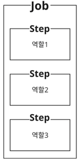
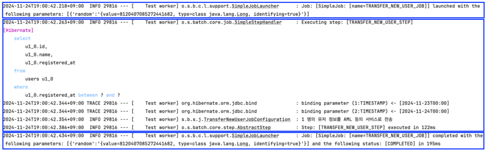

스프링 배치를 본격적으로 알아보기 전에, 기본적인 작업 구성을 파악한다. 예시 코드를 통해 기본적인 Job을 작성하고, 실행해본다.  

# 스프링 배치 기본 구성 코드예시


## 1. 배치 기본 구성(Step & Job)

### 1.1 Job
Spring Batch는 Job이라는 단위로 작업들을 분류할 수 있다. 
소위 말하는 Batch Job을 의미하는데, 이 Job은 **일련의** 작업을 수행한다. 예를 들어, "한 기능에 대한 배치를 작성해야돼"라고 한다면, 하나의 Batch Job을 만든다는 의미다.  

### 1.2 Step
이 Job은 **Step**이라는 녀석을 한 개 이상 가진다. 이 Step은 **실제 배치 작업을 수행하는 역할**로, 설정, 데이터 조회, 배치 로직 실행 등과 같이 Job을 실제로 수행하는 녀석이다.  
즉, 이 Step은 여러가지 역할을 가질 수 있다. 만약 Step이 역할별(데이터 조회 수행, 실제 배치 로직 수행, 데이터 저장 수행 등)로 분리된다면, 각 역할별 Step이 하나의 Job 안에 묶이는 셈이다.  



위와 같이 하나의 Job안에는 여러 Step을 정의할 수 있으며, 이 **Step들이 모여서** 1.1의 Job에서 이야기한 **일련의 작업**이 되는 것이다.  
또한, Job이 여러 개의 Step을 가지듯이 Step도 어떻게 구성하느냐에 따라서 내부 구성이 달라질 수 있는데, 이는 [Step과 관련된 글](../batch4/README.md)에서 자세히 다룬다.  


## 2. Job & Step 정의

실제로 **Job을 정의**하고, **Step을 통해 배치 로직을 구현**해보자.  
[[코드 참고]](src/main/java/sj/batch/stepAndJob/job/TransferNewUserJobConfiguration.java)

#### - UserService.java
```java
@Service
@RequiredArgsConstructor
public class UserService {

    private final UserRepository userRepository;

    public List<User> getUsersRegisteredYesterday() {
        final LocalDateTime start = LocalDateTime.now().minusDays(1).withHour(0).withMinute(0).withSecond(0).withNano(0);
        final LocalDateTime end = LocalDateTime.now().withHour(0).withMinute(0).withSecond(0).withNano(0);
        return userRepository.findByRegisteredAtBetween(start, end);
    }
}
```
- 자정 기준(00:00:00.000)으로 어제 하루동안 신규 가입된 유저를 조회하기 위해 getUsersRegisteredYesterday() 메서드를 사용한다. 


#### - TransferNewUserJobConfiguration.java
```java
@Slf4j
@Configuration
@RequiredArgsConstructor
public class TransferNewUserJobConfiguration {

    private final JobRepository jobRepository;
    private final PlatformTransactionManager platformTransactionManager;
    private static final String JOB_NAME = "TRANSFER_NEW_USER_JOB";
    private static final String STEP_1_NAME = "TRANSFER_NEW_USER_STEP";

    private final UserService userService;

    @Bean
    public Job transferNewUserJob() {
        return new JobBuilder(JOB_NAME, jobRepository) // JobBuilder를 통해 Job을 정의한다.
            .start(transferNewUserStep()) // 아래 정의한 step을 Job에 속하도록 집어 넣는다.
            .build();
    }

    @Bean
    public Step transferNewUserStep() {
        return new StepBuilder(STEP_1_NAME, jobRepository) // StepBuilder를 통해 Step을 정의한다.
            .tasklet((contribution, chunkContext) -> { // Step 로직을 정의
                final List<User> users = userService.getUsersRegisteredYesterday();
                log.info("{} 명의 유저 정보를 AML 등의 서비스로 전송", users.size());
                return RepeatStatus.FINISHED;
            }, platformTransactionManager)
            .build();
    }
} 
```

여기서 봐야할 내용은 딱 두가지다. `transferNewUserJob()`와 `transferNewUserStep()`이다.  
위 클래스를 언뜻 보면, Spring에서 설정 파일에 Bean을 등록하는 것처럼 보인다.  

맞다.  
Spring Batch에서는 @Configuration을 통해, Job을 Bean으로 등록한다.
위 코드를 실행시킬 때, @Bean을 빼도 잘 실행되는 것'처럼' 보인다. 하지만, Bean으로 등록해야 하는 이유와 이점이 있는데, 자세한 이야기는 [JopParameters & Scope]()에서 자세히 다룬다.

어쨌든, 여기서 중요한 것은 **StepBuilder를 통해 Step을 정의**하고, **정의한 Step을JobBuilder를 통해 Job에 끼워 넣었다는 점**이다.  
테스트를 통해 위 코드를 실행 시켜보자.  


### 2.1 테스트 작성

[[코드참고](src/test/java/sj/batch/stepAndJob/job/TransferNewUserJobConfigurationTest.java)]

```java
@Testcontainers
@SpringBootTest
@SpringBatchTest
class TransferNewUserJobConfigurationTest extends TestTemplate {

    @Autowired
    private Job transferNewUserJob;
    @Autowired
    private JobLauncherTestUtils jobLauncherTestUtils;

    @Autowired
    private UserRepository userRepository;
    @Autowired
    private DatabaseTemplate databaseTemplate;

    @BeforeEach
    void setup() {
        jobLauncherTestUtils.setJob(transferNewUserJob);
        databaseTemplate.truncate();
    }

    @Test
    @SneakyThrows
    void run() throws Exception{
        // given
        final User user = UserFixture.create(LocalDateTime.now().minusDays(1));
        userRepository.save(user);

        // when
        JobExecution jobExecution = jobLauncherTestUtils.launchJob();

        // then
        assertThat(jobExecution.getStatus()).isEqualTo(BatchStatus.COMPLETED);
    }
}
```

- `@SpringBatchTest`는 배치 테스트를 위한 Component 등을 자동으로 Bean으로 제공해주는 역할을 한다.
- `TestTemplate`는 MySQL 환경에서 배치 테스트를 하기 위해, 기본적으로 세팅하는 [설정 파일]()이다.(TestContainer를 통해 띄움) 

위 테스트를 통해 TransferNewUserJobConfiguration::transferNewUserJob()을 실행한다.  
테스트 로그와 실제 실행 결과를 비교하기 위해, 결과를 확인해보기 앞서 Job 수행 순서와 예상되는 실행결과를 정의하면 아래와 같다.  
1. Job 실행 시작
2. 정의한 Step 실행
3. Job 종료 (결과 반환)

실제 로그는 아래와 같다.  



1. **첫번째 박스**  
`TRANSFER_NEW_USER_JOB` JOB이 실행되었다. 그런데, 따라오는 parameters 값이 있다. 
자세한 내용은 [메타데이터]()에서 다루지만, 단순하게 Job 실행을 고유하게 식별하기 위한 값이라고 이해하면 된다. random이라는 키로 하여금 Long 타입의 value값이 있다. 
이는 JobLauncherTestUtils에서 제공해주는 값으로, 중복 Job 실행을 막기 위한 값이다. 참고로, **중복 Job 여부의 기준은 JobParameter 값**이다. 
때문에, 테스트 환경에서 중복 Job에 의한 제약을 막기위해 제공하고 있다.  

2. **두번째 박스**  
Job 내부에 정의한 Step이 실행된다. Step 내부에 정의된 데이터 조회(select ~~)와 로그("1 명의 유저 정보를 AML 등의 서비스로 전송)가 찍힌 것을 확인할 수 있다.  

3. **세번째 박스**
Job이 완료되었고, 상태는 `COMPLETED`로 정상처리되었음을 의미한다.
