# 10. 스프링 배치 메타 데이터 - Meta-Data Schema

Spring Batch에는 배치 실행을 관리하기 위한 다양한 메타 데이터들이 존재한다.  
스프링 배치에서는 다양한 메타 데이터들을 관리하기 위한 테이블을 기본적으로 제공한다. Job의 실행 정보와 상태나 세부적으로 Step의 상태 등도 확인할 수 있다.  
[아래 다이어그램](https://docs.spring.io/spring-batch/reference/schema-appendix.html#page-title)은 스프링 배치에서 제공하는 메타 데이터 ERD다.    

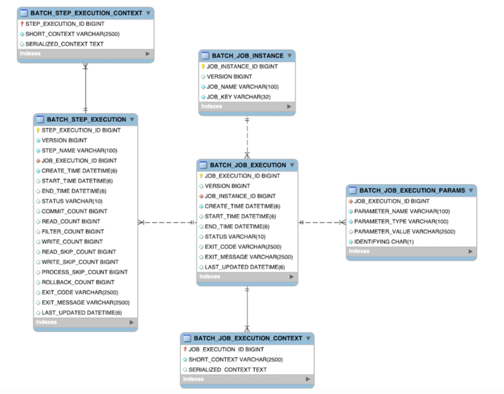

스키마를 하나하나 뜯어보기에 앞서, 예시를 실행시킬 필요가 있다. 아래 예시를 실행 시키고, 각 테이블에 어떤 데이터들이 쌓이는지 살펴보자.   
(참고로 위 다이어그램 중 EXECUTION_CONTEXT 테이블을 설명은 [가장 아래](#105-execution_context-)에서 할건데, 이는 다른 예시 코드로 설명한다. 재실행과 밀접하게 관려되어 있기 때문이다.)

```java
@Slf4j
@Configuration
@RequiredArgsConstructor
public class TransferNewUserJobConfiguration {

    private final JobRepository jobRepository;
    private final PlatformTransactionManager platformTransactionManager;
    private final EntityManagerFactory entityManagerFactory;

    private static final int CHUNK_SIZE = 2;

    @Bean
    public Job transferNewUserJob() {
        return new JobBuilder("transferNewUserJob", jobRepository)
            .start(transferNewUserStep(null))
            .build();
    }

    @Bean
    @JobScope
    public Step transferNewUserStep(
        @Value("#{jobParameters['targetDate']}") LocalDate targetDate
    ) {
        return new StepBuilder("transferNewUserStep", jobRepository)
            .<User, User>chunk(CHUNK_SIZE, platformTransactionManager)
            .reader(reader())
            .processor(processor(null))
            .writer(writer())
            .build();
    }

    @Bean
    @StepScope
    public JpaPagingItemReader<User> reader() {
        return new JpaPagingItemReaderBuilder<User>()
            .name("reader")
            .entityManagerFactory(entityManagerFactory)
            .queryString("""
                SELECT u
                FROM User u
                """)
            .pageSize(CHUNK_SIZE)
            .build();
    }

    @Bean
    @StepScope
    public ItemProcessor<User, User> processor(
        @Value("#{jobParameters['targetDate']}") final LocalDate targetDate
    ) {
        return new FunctionItemProcessor<>(user -> {
            if (user.getRegisteredAt().toLocalDate().isEqual(targetDate)) {
                log.info("targetDate => {}", targetDate);
                return user;
            }
            return null;
        });
    }

    @Bean
    public ItemWriter<User> writer() {
        return chunk -> chunk.getItems().forEach(user ->
            log.info("DB에 유저 정보 저장 =>  id: {}, name: {}", user.getId(), user.getName())
        );
    }
}
```

그리고, 테스트 데이터는 총 User 데이터를 6개 저장했다. `registeredAt`은 다 하루 전으로 저장했기 때문에, processor에서 하나도 걸러지지 않는다.  

---

## 10.1 JOB_INSTANCE

아래는 `BATCH_JOB_INSTANCE` 테이블의 스키마다.  

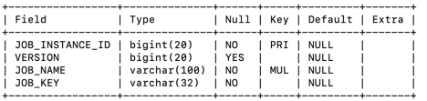  

말그대로 하나의 배치 Job을 관리하는 테이블이다. Job의 아이디나 이름 등을 저장한다.   
각 필드를 살펴보기에 앞서, 해당 테이블을 생성하는 DDL 스크립트를 살펴보자.   

```sql
CREATE TABLE BATCH_JOB_INSTANCE  (
	JOB_INSTANCE_ID BIGINT  NOT NULL PRIMARY KEY ,
	VERSION BIGINT ,
	JOB_NAME VARCHAR(100) NOT NULL,
	JOB_KEY VARCHAR(32) NOT NULL,
	constraint JOB_INST_UN unique (JOB_NAME, JOB_KEY)
);
```

`JOB_NAME`과 `JOB_KEY`가 하나로 묶여 Unique constraint를 구성하고 있음을 확인할 수 있다. 즉, Job의 중복여부는 이 두 필드가 결정하게 되는 것이다.  
예시를 실행시키면 어떤 값이 저장될까?? 아래는 예시를 실행시킨 직후의 `BATCH_JOB_INSTANCE`이다.  

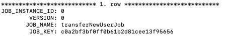

예시에서 실행한 `transferNewUserJob`이 저장되어있다.   
여기서, `JOB_KEY`는 `Job Parameters`를 해싱한 결과 값이다. 이걸 또 다르게 말하면, Job은 Job Parameters와 Job Name으로 고유함을 나타내는 것이다. 
때문에, 하나의 Job에서 동일한 Job Parameters을 주어 실행하면, 중복 Job 실행이라고 하면서 에러가 발생하는 것이다.(`JobInstanceAlreadyCompleteException`)    
[관련 정리 글 참고 - batch3](../batch03)


---

## 10.2 JOB_EXECUTION

`JOB_EXECUTION`은 Job의 실행 인스턴스를 의미한다. 즉, `BATCH_JOB_INSTANCE`를 실행시킨 실행 객체의 정보를 저장하는 테이블인 셈이다.  
예시를 실행하면 어떤 값이 저장되는지 바로 살펴보자.     

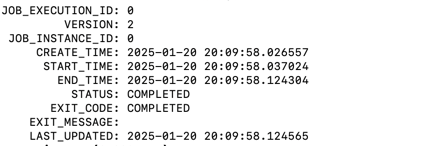

- `JOB_INSTANCE_ID`는 위에서 살펴본 Job id를 의미한다. `JOB_INSTANCE`를 실행시킨 녀석이니 당연히 id를 가지고 있어야 한다. 
- `CREATE_TIME`은 `JobExecution`이 생성된 시간을 의미한다. ([JobExecution의 생성과 실행 - batch03](../batch03))
- `START_TIME`은 배치 작업이 실제로 시작된 시점이다. 당연히 `END_TIME`은 작업이 완료된 시점이다.
- `STATUS`는 현재 실행 상태를 나타내는 상태값이다. `BatchStatus`라는 enum 값이 문자열로 컨버팅되어 저장된다. 
- `EXIT_CODE`는 실행 종료 코드를 나타내는 값이다. 

`STATUS`와 `EXIT_CODE`가 똑같이 "COMPLETED"로 되어 있어, 같은 값을 공유하는 것으로 보일 수 있다.  
하지만, 이 둘은 다른 상태들을 정의하고 있는데 아래 두 클래스를 가져왔다.   

- BatchStatus
```java
public enum BatchStatus {
    COMPLETED,
    STARTING,
    STARTED,
    STOPPING,
    STOPPED,
    FAILED,
    ABANDONED,
    UNKNOWN;
}
```

- ExitStatus
```java
public class ExitStatus implements Serializable, Comparable<ExitStatus> {
    public static final ExitStatus UNKNOWN = new ExitStatus("UNKNOWN");
    public static final ExitStatus EXECUTING = new ExitStatus("EXECUTING");
    public static final ExitStatus COMPLETED = new ExitStatus("COMPLETED");
    public static final ExitStatus NOOP = new ExitStatus("NOOP");
    public static final ExitStatus FAILED = new ExitStatus("FAILED");
    public static final ExitStatus STOPPED = new ExitStatus("STOPPED");
    private final String exitCode;
    private final String exitDescription;
}
```

status에 저장되는 `BatchStatus` 값은 Job의 현재 상태를 정의해놓은 값이고, exit_code에 저장되는 `ExitStatus` 값은 종료될 수 있는 값들이다. 
그리고, `exit_status`는 필요한 경우 사용자 정의 값으로 설정할 수도 있다.  

추가로, 이 `status` 필드가 중요한 것은 바로 재시도다.  
10.2에서 Job의 중복 여부는 JobParameters라고 했다. 하지만, 동일한 JobParameters로 동일한 Job을 실행한다 하더라도 성공한 Job이 아니라면 재수행이 가능하다.  

---

## 10.3 BATCH_JOB_EXECUTION_PARAMS
마찬가지로 예시 실행 결과를 바로 살펴보며 파악해보자.   

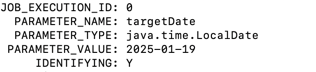

`BATCH_JOB_EXECUTION_PARAMS`는 Job을 실행시킬 때 넘긴, 즉 `Job Parameters`를 기록하는 테이블이다.  
`PARAMETER_NAME`이나 `PARAMETER_TYPE` 등과 같은 것은 직관적으로 이해할 수 있으니 넘어가고, 중요한 필드는 `IDENTIFYING`이다.   

`JOB_INSTANCE`의 중복 여부를 판단할 때, key 값은 `Job Parameters`를 해싱한 값이라고 했다. 
이때 `JobParameter`별로 해싱에 참여시킬지 말지 결정할 수 있는데, 그 boolean 값이 바로 `identifying`이다.  

즉, 이녀석을 false로 하면 Job의 중복 여부를 결정하는데 아무런 영향이 없음을 의미한다. [identifying의 자세한 내용 - batch3](../batch03)

---

## 10.4 STEP_EXECUTION
예시 실행 결과에 어떤 데이터가 들어있는지 바로 살펴보자.    

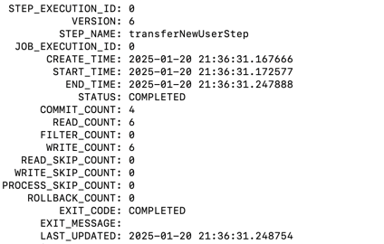

Step의 실행 상태인 `StepExecution` 객체 정보가 기록되는 테이블이다. [Step의 생성/실행 원리 - batch04](../batch04)

Step은 Job의 하위개념이고, Step의 실행 결과가 Job의 실행결과에 영향을 미친다. 
때문에 특정 Job의 실행 상태인 `JobExecution`을 FK로 가지고 있으며, 특정 JobExecution에 속한 `StepExecution`들 중 하나라도 실패하면 `JobExecution`도 실패한다.   
이에 대한 소스코드 분석은 [batch04](../batch04)글을 참고하면 된다. 

저장된 데이터를 보니, `transferNewUserJob` 내부에 정의된 하나의 Step인 `transferNewUserStep`이 기록되어 있다. 
해당 Step의 실행 상태를 저장하고 있다. 3, 4 등 불규칙한 count값들이 저장되어 있는데 무엇인지 살펴보자.   

- `COMMIT_COUNT: 4`   
데이터 커밋이 세 번 발생했음을 의미한다. 네 번에 걸쳐 데이터 커밋이 발생한 것이다. 
chunk size 단위 커밋이면 3이어야 하는데 왜 4이지? 라는 의문을 가질 수 있지만, Step/Job 종료 시에 최종 상태를 저장하기 위한 커밋임을 인지하면 된다.   

- `READ_COUNT: 6`, `WRITE_COUNT: 6`
총 6개의 더미 데이터를 읽고, processor에서 하나도 걸러지지 않았기 때문에 동일한 값이 나왔다.  

---

## 10.5 EXECUTION_CONTEXT 

ExecutionContext의 개념에 대해 알아보기 전에, 가볍게 StepExecution/JobExecution의 상태를 저장하고 공유하는 객체라고만 이해하자.  

때문에, Batch에서 제공하는 메타데이터에는 `JOB_EXECUTION_CONTEXT`와 `STEP_EXECUTION_CONTEXT` 두 가지를 제공한다.  
두 테이블의 스키마는 아래와 같다.  

- `JOB_EXECUTION_CONTEXT`   

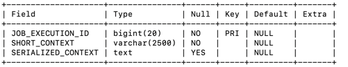    

- `JOB_EXECUTION_ID`: `BATCH_JOB_EXECUTION` FK   
- `SHORT_CONTEXT`: SERIALIZER_CONTEXT의 String version   
- `SERIALIZED_CONTEXT`: 직렬화된 ExecutionContext

  
- `STEP_EXECUTION_CONTEXT`    

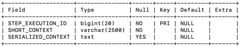

- `JOB_EXECUTION_CONTEXT`의 필드와 같은 의미의 필드들을 가진다.   

----

그래서, `ExecutionContext`라는게 무엇일까?  

`ExecutionContext`은 **Job 실행 동안**에 필요한 데이터를 저장하고 관리할 수 있도록 Spring Batch에서 제공하는 key/value 형식의 상태 저장소 객체이다.  
이 `ExecutionContext`는 실행 범위에 따라 두 형식으로 나뉜다.  

**Job 실행 동안에** 필요한 데이터를 저장하는 공간이라고 했다. Job이 실행된다는 것은 **Job** 그 자체가 실행되는 것도 있지만, 더 작은 범주의 실행 단위인 **Step**도 있다.   
그래서, Spring Batch에서는 `JobExecutionContext`와 `StepExecutionContext` 두 개의 ExecutionContext를 지원한다.  

관계도와 함께 설명해보면 아래와 같다.  

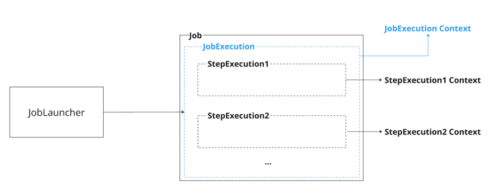

`JobExecutionContext`는 Job의 실행 범위 내에서 사용된다. Job 실행 범위이기 때문에, Step에서도 접근이 가능하다.  
`JobExecution#getExecutionContext()`을 통해 접근할 수 있다.   

`StepExecutionContext`는 Step의 실행 범위 내에서 사용 가능하다. 이것 또한 StepExecution 객체에서 접근이 가능한데, 아래와 같이 사용 가능하다.   

```java
ExecutionContext executionContext = stepExecution.getExecutionContext();
executionContext.put("key", "value");
executionContext.get("key");
```

실행 중에 상태를 관리하는 이 `ExecutionContext`의 값들을 DB에 영속화 시키기 위한 테이블이 바로 `BATCH_JOB_EXECUTION_CONTEXT`, `BATCH_STEP_EXECUTION_CONTEXT`인 것이다.  
새로운 예시를 통해, Step의 실패를 유도하고 실패지점부터 재시작이 가능하도록 StepExecutionContext를 잘 써먹어보자.

<br>

### 10.5.1 ExecutionContext 예시코드 

reader(), processor(), writer()를 새롭게 정의할 것이다. 그리고, StepExecutionContext에 직접 접근해서 값을 저장하고, 가져와볼 것이다.  


- **ItemReader()**
```java
@Component
public class CustomReader implements ItemReader<String>, StepExecutionListener {

  private List<String> data = List.of("A", "B", "C", "D", "E");
  private int currentIndex = 0;
  private ExecutionContext executionContext;

  @Override
  public void beforeStep(StepExecution stepExecution) {
    // ExecutionContext 초기화
    this.executionContext = stepExecution.getExecutionContext();

    // ExecutionContext에서 이전 상태 복구
    if (executionContext.containsKey("current.index")) {
      currentIndex = executionContext.getInt("current.index");
    }
  }

  @Override
  public String read() {
    if (currentIndex >= data.size()) {
      return null;
    }

    // 현재 처리 중인 데이터 저장
    executionContext.putInt("current.index", currentIndex);
    
    if (data.get(currentIndex).equals("C")) { // 예: C에서 실패
      executionContext.putString("failed.item", "C");
      throw new RuntimeException("Processing failed for item: " + "C");
    }
    return data.get(currentIndex++);
  }

  @Override
  public ExitStatus afterStep(StepExecution stepExecution) {
    return ExitStatus.COMPLETED;
  }
}
```

ItemReader()를 직접 구현했는데, beforeStep()과 afterStep()을 정의했다. 몇 가지 설명할 부분은 아래와 같다.    
- `beforeStep()`에서 StepExecutionContext를 가져오고, StepExecution에서 저장해놓은 인덱스를 가져온다.  
- `read()`에서는 `beforeStep()`에서 세팅한 가장 최신의 인덱스를 가지고, 해당 인덱스부터 다시 데이터를 읽기 시작한다. 
  데이터를 읽어드리면 인덱스를 최신화 하기 위해 ExecutionContext에 값을 업데이트한다.
- "C"라는 문자를 만나면, 실패를 유도할 것이다. `["A", "B", "C", "D", "E"]` 리스트 중, 세 번째 인덱스에서 step이 실패할 것이다.


<br>

- **ItemProcessor()**
```java
@Component
public class CustomProcessor implements ItemProcessor<String, String>, StepExecutionListener {

  private ExecutionContext executionContext;

  @Override
  public String process(String item) {
    return item.toLowerCase();
  }

  @Override
  public void beforeStep(StepExecution stepExecution) {
    this.executionContext = stepExecution.getExecutionContext();
  }

  @Override
  public ExitStatus afterStep(StepExecution stepExecution) {
    return ExitStatus.COMPLETED;
  }
}
```

- `processor()`는 그냥 구성했다.


**테스트 시나리오**는 아래와 같다.
- 아래 batch job을 정의한 것처럼 청크 사이즈는 2로 설정해서, 첫 번째 커밋(`["A", "B"]`)을 정상 처리 후 두번째 커밋에서 실패
- Step이 `FAILED`처리가 되고, 자연스럽게 Job도 `FAILED` 처리가 된다.
- `read()`메서드의 exception을 유도하는 코드를 주석처리하고, 동일한 Batch job을 재실행한다. -> "C"부터 데이터가 정상 처리

```java
@Slf4j
@Configuration
@RequiredArgsConstructor
public class ExecutionContextTestJobConfiguration {

    private final JobRepository jobRepository;
    private final PlatformTransactionManager platformTransactionManager;
    private ExecutionContext executionContext;

    @Bean
    public Job executionContextTestJob() {
        return new JobBuilder("EXECUTION_CONTEXT_TEST_JOB", jobRepository)
            .start(step())
            .build();
    }

    @Bean
    public Step step() {
        return new StepBuilder("STEP", jobRepository)
            .<String, String>chunk(2, platformTransactionManager)
            .reader(reader())
            .processor(processor())
            .writer(writer())
            .build();
    }

    @Bean
    public CustomReader reader() {
        return new CustomReader();
    }

    @Bean
    public CustomProcessor processor() {
        return new CustomProcessor();
    }

    @Bean
    public ItemWriter<String> writer() {
        return items -> System.out.println("Writing items: " + items);
    }
}
```


위 `EXECUTION_CONTEXT_TEST_JOB`을 실행시켜보면 아래오 같은 결과가 나온다. 


`BATCH_STEP_EXECUTION`에 데이터가 아래와 같이 들어왔다. 
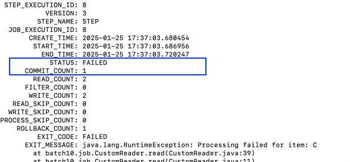
  step의 결과가 `FAILED` 처리가 되었고, 커밋 수는 1이다. 

커밋된 데이터는 아래와 같이 `[a, b]`인 것을 로그를 통해 확인할 수 있다.  


  

`BATCH_STEP_EXECUTION_CONTEXT`에 들어간 데이터를 살펴보자.  

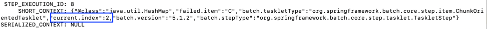

`reader`에서 저장한 `current.index`값이 저장되어 있다. 'C'의 인덱스인 2가 저장되어 있다.

step이 실패했으니, 이에 따라 `BATCH_JOB_EXECUTION`의 결과도 `FAILED`로 저장되었다.

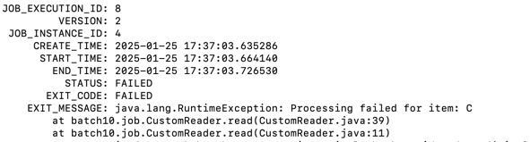

<br>

위 상태에서 reader 예외 메서드를 제거하고 재실행해보자.

아래 로그와 같이 c부터 시작해서 청크 단위만큼 재실행 된 것을 확인할 수 있다.   


`BATCH_STEP_EXECUTION`은 `COMPLETED`상태의 실행 결과가 들어왔다.  

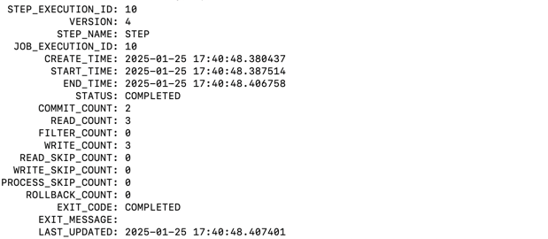

이에 따라 `BATCH_JOB_EXECUTION`의 결과도 `COMPLETED`로 저장되었다.  

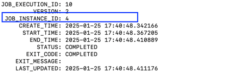

결과적으로 ID 4인 Batch job은 성공으로 처리된 것이다.  


----

단순한 예시를 통해 ExecutionContext를 알아봤지만, 필요에 따라 적절한 값(_e.g. 배치 job 실행 시점의 환율 값_)을 저장해두고 사용할 수도 있다.
