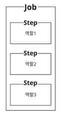
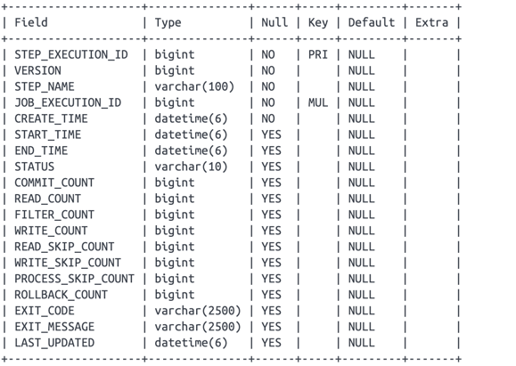
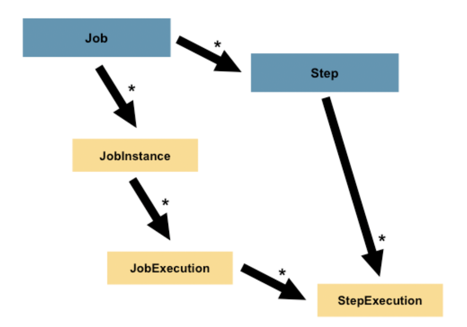
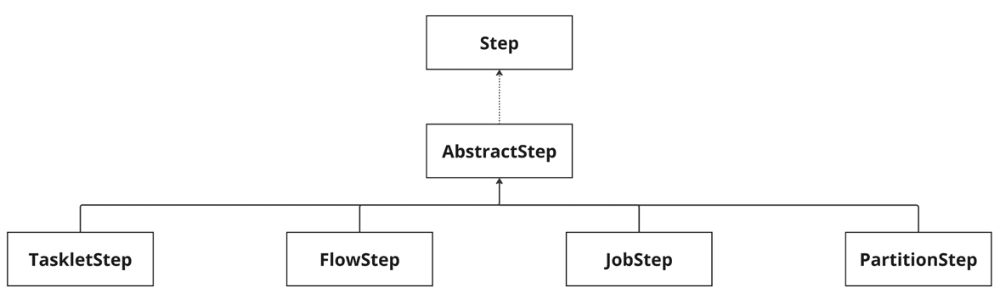
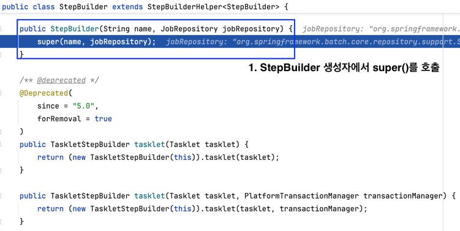
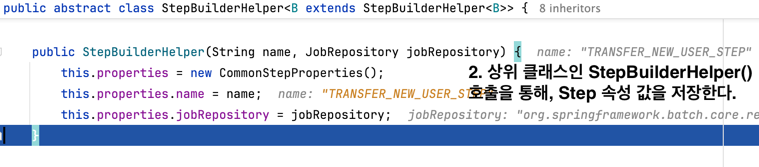
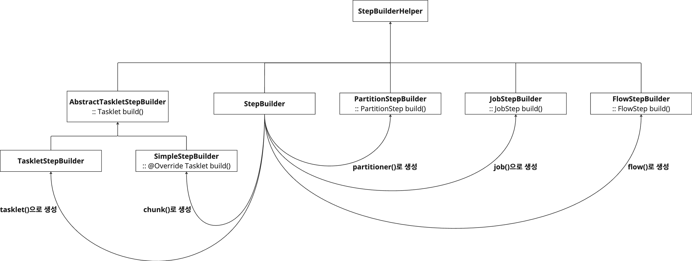
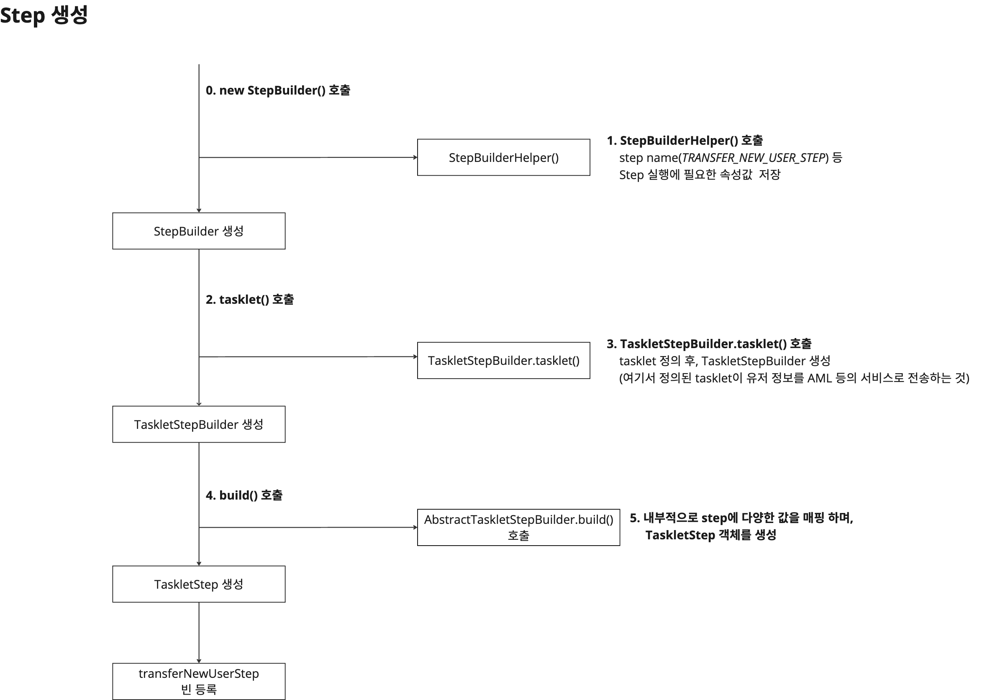
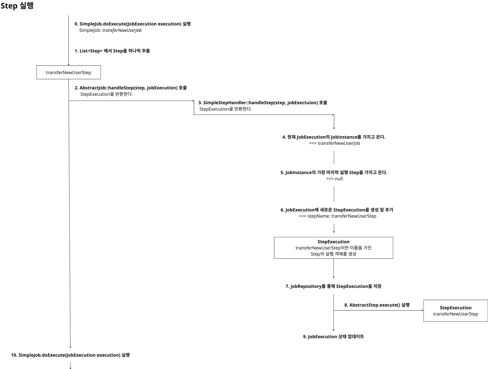

# 4. Step의 기본 구성과 생성원리, 그리고 실행원리 - StepBuilder & Step 

지난 글들에서 [Job의 개념과 기본 구성](../batch2/README.md), [Job의 생성원리와 동작원리](../batch3/README.md)에 대해 파악했다.  

같은 순서로, 이번엔 Step에 대해 알아보고자 한다. Step이 무엇이고, 관련된 개념에는 어떤 것들이 있는지 살펴본다.  
더 나아가 Step의 종류와 생성원리, 동작원리에 대해 깊게 파악해보고자 한다.  


## 4.1 Step이란?
[Job에 대한 기본적인 설명](../batch2/README.md)을 하면서, Job은 "전체 배치 프로세스를 **캡슐화**하는 엔티티"라고 표현했었다.  
이와 비슷하게 Step은 "Job의 독립적인 순차적 단계를 **캡슐화**하는 엔티티"라고 공식문서에서 정의한다. 
사실, 개인적으로는 Step을 "Job의 세부 작업 단위를 의미하며, 세부적으로 나뉜 작업을 실행하는 논리적 단계"라고 표현하는 것을 좋아한다.  
즉, Job은 하나 이상의 Step을 가지고 있어야 하며, 이 Step에는 배치작업을 처리하기 위한 프로세스를 가진다.  

위 내용을 토대로 하여 Job과 Step의 관계를 그림으로 표현하면 아래와 같다.  




Step은 여러가지 역할을 가질 수 있으며, 만약 Step이 역할별(데이터 조회 수행, 실제 배치 로직 수행, 데이터 저장 수행 등)로 분리된다면, 각 역할별 Step이 하나의 Job 안에 묶이는 셈이다. 

결국, Step은 배치작업을 처리하기 위한 최소한의 단계이고, 내부적으로 실제 배치 작업을 수행하는 주체이다. 그렇다면 Step의 실행 상태도 관리되어야 하지 않을까?(Job의 실행상태를 관리하는 JobExecution처럼)  
그래서, JobExecution과 같은 개념으로 Step에도 StepExecution이 존재한다. 즉, Step의 실행을 의미하는 StepExecution 객체가 존재한다.  


## 4.2 StepExecution?
결국, Step에도 실행을 의미하는 객체인 StepExecution이 있고, 이 녀석이 Step의 실행상태를 관리한다. JobExecution이 BATCH_JOB_EXECUTION 메타데이터 테이블로 관리되는 것처럼, StepExecution도 메타데이터 테이블이 지원된다.  
`BATCH_STEP_EXECUTION`라는 테이블로 관리된다. 스키마를 통해 중요한 포인트 몇 가지만 확인해보자   



- `STEP_NAME`: Step을 정의할 때, 지정한 Step 이름이다. 
- `JOB_EXECUTION_ID`: JobExecution과 StepExecution은 1:N 관계다.  
StepExecution이 모두 성공해야만 JobExecution도 성공한다. 즉, StepExecution들 중에 하나라도 실패하면 JobExecution은 실패처리가 된다.  
또한, Job이 재시작 되어도 실패한 Step에 한해서만 재실행된다.  
- `COMMIT_COUNT`, `READ_COUNT`, `WRITE_COUNT` 등: Step의 실행 과정을 모니터링하는 역할을 한다. 각각 트랜잭션 커밋 횟수, 데이터를 읽고/쓴 횟수를 의미한다. 
뿐만 아니라 `FILTER_COUNT`나 `READ_SKIP_COUNT` 등 다양한 count필드가 있는데, 이들 모두 step이 실행되면서, 데이터를 어떤 식으로 사용하는지 추적하는데 용이한 필드로 활용된다.  


공식문서에서 제공하는 Job-Step의 계층구조를 끝으로 기본개념에 대한 설명을 마친다.  



## 4.3 Step의 기본 구조와 생성 원리

Job과 Step의 관계에 대해 위에서 알아봤다. 이번에는 Job 하위 개념으로 속하는 Step을 어떤 식으로 구성는지 알아보고, 구조에 대해 알아보자.  
우선, 예시를 통해 Step 구성을 파악해보자.  

### 4.3.1 예시 코드

```java
@Slf4j
@Configuration
@RequiredArgsConstructor
public class TransferNewUserJobConfiguration {

    private final JobRepository jobRepository;
    private final PlatformTransactionManager platformTransactionManager;
    private static final String JOB_NAME = "TRANSFER_NEW_USER_JOB";
    private static final String STEP_1_NAME = "TRANSFER_NEW_USER_STEP";

    private final UserService userService;

    @Bean
    public Job transferNewUserJob() {
        return new JobBuilder(JOB_NAME, jobRepository)
            .start(transferNewUserStep(null))
            .build();
    }


    @Bean
    @JobScope
    public Step transferNewUserStep(
        @Value("#{jobParameters['targetDate']}") LocalDate targetDate
    ) {
        return new StepBuilder(STEP_1_NAME, jobRepository) // StepBuilder 호출
            .tasklet((contribution, chunkContext) -> { // TaskletStep을 만들기 위한 호출
                final List<User> users = userService.findByRegisteredDate(targetDate);
                log.info("{} 명의 유저 정보를 AML 등의 서비스로 전송", users.size());
                return RepeatStatus.FINISHED;
            }, platformTransactionManager)
            .build(); // TaskletStep 생성
    }
}
```

위 코드에서 파악해볼 부분은 `transferNewUserStep()`메서드다. 이 메서드는 하나의 Step을 정의해서, return하고 있다.  
어떻게 Step을 구성하는지 해당 메서드만 살펴보자.  


### 4.3.2 Step의 구조



Step도 [Job과 굉장히 비슷한 구조](../batch3/README.md)를 가진다. 
공통 부분은 AbstractStep으로 묶여 있고, 각 종류별로 서로다른 실행방식을 가진 각 Step들은 이를 상속받아 구현하고 있는 형태다.  

각 Step의 간략한 특징은 아래와 같다. 자세한 설명은 별도의 장에서 설명한다.    
- `TaskletStep`: `Tasklet`을 호출해, 작업을 처리하는 방식의 Step(Tasklet에 대한 자세한 설명은 4.3.4 참고)
- `FlowStep`: `Flow`에게 작업을 위임하는 방식의 Step
- `JobStep`: 별도의 `Job`에게 작업을 위임하는 방식의 Step
- `PartitionStep`: 멀티 스레딩 방식으로 작업을 처리하는 방식의 Step

Step의 종류는 위와 같이 네 종류가 있고, 우선 각 Step의 특징은 위 정도만 이해해두자. Tasklet이 뭐고, Flow가 무엇인지는 뒤이어서 정리한다.  

각 Step은 어떤 구조로 실행되고, 위에서 작성한 예시에서의 transferNewUserStep()은 어떤 Step이 실행되는지 등의 **실행 원리**를 알아봐야 한다.  
하지만, Job의 생성 원리를 이해하고 실행 원리를 이해한 것처럼, 역시나 Step도 어떻게 **Step**이 생성되는지 **생성 원리를 먼저 살펴보자.**  


### 4.3.3 Step의 생성 원리

아래 Step 구성을 기반으로 설명한다.
```java
@Bean
@JobScope
public Step transferNewUserStep(
    @Value("#{jobParameters['targetDate']}") LocalDate targetDate
) {
    return new StepBuilder(STEP_1_NAME, jobRepository) // StepBuilder 호출
        .tasklet((contribution, chunkContext) -> { // TaskletStep을 만들기 위한 호출
            final List<User> users = userService.findByRegisteredDate(targetDate);
            log.info("{} 명의 유저 정보를 AML 등의 서비스로 전송", users.size());
            return RepeatStatus.FINISHED;
        }, platformTransactionManager)
        .build(); // TaskletStep 생성
}
```

<br>

#### 4.3.3.1 StepBuilder() 호출



`new StepBuilder()`를 통해 StepBuilder 생성자를 호출했고, 내부적으로 StepBuilderHelper를 호출하고 있다.  

<br>

#### 4.3.3.2 상위 클래스인 StepBuilderHelper() 호출: Step 속성값 저장



`CommonJobProperties`는 StepBuilderHelper 클래스의 내부 클래스로 정의되어 있으며, Step 실행에 필요한 다양한 속성 값들을 내부 필드로 가지고 있다.

<br>

#### 4.3.3.3 StepBuilder 객체 생성 완료 & 다음으로 호출할 메서드는?

위 1,2 과정(`new StepBuilder()`)을 통해서 StepBuilder 객체를 생성했다. 
그 다음으로 호출할 메서드에 따라 어떤 종류의 step이 생성될지 달라지는데, 어떤 의미인지 StepBuilder 클래스를 살펴보자.  

필요한 부분만 가져오기 위해 소스코드를 그대로 부분 발췌했다.  
```java
public class StepBuilder extends StepBuilderHelper<StepBuilder> {

    public TaskletStepBuilder tasklet(Tasklet tasklet, PlatformTransactionManager transactionManager) {
        return (new TaskletStepBuilder(this)).tasklet(tasklet, transactionManager);
    }

    public <I, O> SimpleStepBuilder<I, O> chunk(int chunkSize, PlatformTransactionManager transactionManager) {
        return ((SimpleStepBuilder)(new SimpleStepBuilder(this)).transactionManager(transactionManager)).chunk(chunkSize);
    }

    public PartitionStepBuilder partitioner(String stepName, Partitioner partitioner) {
        return (new PartitionStepBuilder(this)).partitioner(stepName, partitioner);
    }

    public JobStepBuilder job(Job job) {
        return (new JobStepBuilder(this)).job(job);
    }

    public FlowStepBuilder flow(Flow flow) {
        return (new FlowStepBuilder(this)).flow(flow);
    }
    
    // ...
}
```

4.3.2에서 살펴봤던 Step의 구현체들이 있었다. 각 구현체를 만드는 빌더 클래스들이 존재한다. 
즉, **StepBuilder는 Step의 각 구현체를 생성하기 위해 각 StepBuilder에게 그 역할을 위임**하는 것이다. 
예를 들어, StepBuilder가 TaskletStep을 생성하고 싶다면, TaskletStepBuilder에게 그 행위를 넘긴다.  


---

여기까지 Step 구현체를 생성하는 흐름을 디버깅을 통해 알아봤다. 
각 구현체에 따라 받는 파라미터는 다르므로, 별도의 챕터에서 설명할 예정이다.  
다시한번 처음 예제 코드로 돌아가서 다시한번 살펴보자.  

```java
@Bean
@JobScope
public Step transferNewUserStep(
    @Value("#{jobParameters['targetDate']}") LocalDate targetDate
) {
    return new StepBuilder(STEP_1_NAME, jobRepository) // StepBuilder 호출
        .tasklet((contribution, chunkContext) -> { // TaskletStep을 만들기 위한 호출
            final List<User> users = userService.findByRegisteredDate(targetDate);
            log.info("{} 명의 유저 정보를 AML 등의 서비스로 전송", users.size());
            return RepeatStatus.FINISHED;
        }, platformTransactionManager)
        .build(); // TaskletStep 생성
}
```

1. `new StepBuilder()`: StepBuilderHelper를 호출해, Step에 필요한 다양한 속성값을 설정한다. 
2. `tasklet()`: 다양한 메서드 중에 `tasklet()`을 호출하여, `TaskletStepBuilder`에게 Step 생성을 위임한다. 여기서 Step은 구체적으로 TaskletStep이다. 
3. `build()`: TaskletStepBuilder::build()를 호출하여, `TaskletStep`을 생성한다. (**정확히는 TaskletStepBuilder에는 build()가 없고, 그 상위 클래스인 AbstractTaskletStepBuilder 클래스에 구현**되어있다.)

Step의 구현체를 생성하기 위한 엔티티 다이어그램을 그리면 아래와 같다.




----

4.3절에서는 Step 객체 생성을 위한 구조와 원리에 대해 알아봤다. 이제는 생성된 Step이 어떻게 실행되는지. 그 실행 원리에 대해 알아볼 것이다.  


## 4.4 Step의 실행원리

Step의 실행원리를 설명하기에 앞서, Step은 기본적으로 Job이 실행하는 주체이므로 Job에 종속적인 관계일 수 밖에 없다. 
때문에, Job의 실행에서부터 시작해서 Step의 실행까지 흘러가는 플로우이다. 
본 글에서 Job의 실행원리를 설명하기엔 양이 방대하기 때문에, **[이전 글](../batch3/README.md)에 대한 컨텍스트가 있어야만 한다.**  

[이전 글의 3.1.2.7](../batch3/README.md)절에서 **SimpleJob::doExecute()** 코드에 대한 설명은 넘어갔다. 
이유는 step을 실행하는 로직이 대부분이었기 때문인데, **여기서부터 본 글에서 설명**하고자 한다.  


----

### 4.4.1 SimpleJob의 실행

이전 글을 살짝 요약하면 아래와 같다.   
같은 예제로 SimpleJob이 생성되고, 실행되는 것까지 디버깅을 통해 확인했다. 그 과정에서 AbstractJob::execute()가 실행 되었고, 내부적으로 SimpleJob::doExecute()가 호출되었다.  

추가로, 이건 어디까지나 SimpleJob을 기반으로 설명하는 것이다. 각 Job마다 doExecute() 구현 방법도 다르기 때문에, 다를 수 있다는 것을 염두에 둬야 한다.  

#### 4.4.1.1 SimpleJob::doExecute()

```java
public class SimpleJob extends AbstractJob {

    private final List<Step> steps;

    protected void doExecute(JobExecution execution)
        throws JobInterruptedException, JobRestartException, StartLimitExceededException {
        StepExecution stepExecution = null; 
        Iterator var3 = this.steps.iterator(); // 1. steps에 저장된 step들을 반복하여 실행하기 위함 

        while (var3.hasNext()) {  // 1. steps에 저장된 step들을 반복하여 실행한다.
            Step step = (Step) var3.next();
            stepExecution = this.handleStep(step, execution); // 2. 각 Step을 하나씩 처리한다. 그리고, 실행 상태를 업데이트 한다.
            if (stepExecution.getStatus() != BatchStatus.COMPLETED) {
                break;
            }
        }

        if (stepExecution != null) {
            if (logger.isDebugEnabled()) {
                logger.debug("Upgrading JobExecution status: " + stepExecution);
            }
            
            execution.upgradeStatus(stepExecution.getStatus()); // 3. BatchStatus를 JobExecution에 반영
            execution.setExitStatus(stepExecution.getExitStatus()); // 4. ExitStatus를 JobExecution에 반영
        }
    }
}
```

SimpleJob은 멤버로 List<Step> 타입의 `steps`를 가지고 있다. 이전 글에서 설명했듯이 Job 생성 시, SimpleJobBuilder::build()에서 정의된 step 리스트를 SimpleJob 멤버에 저장한다.  
그렇게 아래와 같이 SimpleJob::doExecute()는 아래 순서와 같이 수행된다.  

1. 저장된 Step 리스트를 하나씩 순회하면서 작업을 수행
2. 각 Step을 수행하고, `stepExecution` 변수에 실행 상태를 업데이트한다. 그리고, Step의 실행 결과가 `COMPLETED`가 아니라면 작업을 중지한다.
Step 작업을 수행하는 `handleStep()` 메서드를 호출하고 있는데, 이 메서드는 다음 절에서 알아보겠다.
3. StepExecution에는 `status`와 `exitStatus` 필드를 가지고 있다. 각각 BatchStatus라는 enum 타입, ExitStatus라는 클래스 타입이다.
Job의 현재 실행 상태와 종료 상태를 의미한다.  
3번에서는, 현재 StepExecution의 상태를 JobExecution 상태에 반영한다. 
4. 현재 StepExecution의 종료 상태를 JobExecution의 종료 상태에 반영한다. 


2번에서 `handleStep()`을 통해 Step을 처리한다고 했다. 내부적으로 어떻게 처리되는지 알아보자.  


#### 4.4.1.2 AbstractJob::handleStep()

```java
public abstract class AbstractJob implements Job, StepLocator, BeanNameAware, InitializingBean {

    private StepHandler stepHandler;
    // ...
    
    protected final StepExecution handleStep(Step step, JobExecution execution)
            throws JobInterruptedException, JobRestartException, StartLimitExceededException {
        return this.stepHandler.handleStep(step, execution);
    }
    // ...
}
```

`handleStep()` 메서드는 `AbstractJob`클래스에 구현되어 있는 메서드다. 내부적으로 StepHandler::handleStep()을 호출하는 역할만 한다.  
`StepHandler`는 Step 처리를 위한 인터페이스로 `SimpleStepHandler` 구현체만 존재한다. (5.1 기준)  

그래서, 다음으로는 `SimpleStepHandler`의 `handleStep()` 메서드를 살펴볼 것이다.   

#### 4.4.1.3 SimpleStepHandler::handleStep()

```java
public StepExecution handleStep(Step step, JobExecution execution) throws JobInterruptedException, JobRestartException, StartLimitExceededException {
        if (execution.isStopping()) {
            throw new JobInterruptedException("JobExecution interrupted.");
        } else {
            JobInstance jobInstance = execution.getJobInstance();  // 1. 현재 JobExecution의 JobInstance를 가지고 온다.
            StepExecution lastStepExecution = this.jobRepository.getLastStepExecution(jobInstance, step.getName()); // 2. JobInstance의 가장 마지막 실행 Step을 가지고 온다. 
            if (this.stepExecutionPartOfExistingJobExecution(execution, lastStepExecution)) {
                if (logger.isInfoEnabled()) {
                    logger.info("현재 Job에서 중복된 Step 실행이 감지되었다는 내용");
                }
                lastStepExecution = null;
            }

            StepExecution currentStepExecution = lastStepExecution;
            if (this.shouldStart(lastStepExecution, execution, step)) { // 3. 가장 마지막으로 가져온 Step이 실행되어야 하는지 검증
                currentStepExecution = execution.createStepExecution(step.getName()); // 4. JobExecution에 새로운 StepExecution을 추가한다. 
                boolean isRestart = lastStepExecution != null && !lastStepExecution.getStatus().equals(BatchStatus.COMPLETED);
                if (isRestart) { // 5-1. 재실행된 Step이면, ExecutionContext를 그대로 설정한다.
                    currentStepExecution.setExecutionContext(lastStepExecution.getExecutionContext());
                    if (lastStepExecution.getExecutionContext().containsKey("batch.executed")) {
                        currentStepExecution.getExecutionContext().remove("batch.executed");
                    }
                } else { // 5-2. 새로 실행된 Step이라면, 새로운 ExecutionContext를 생성해서 설정한다.
                    currentStepExecution.setExecutionContext(new ExecutionContext(this.executionContext));
                }

                this.jobRepository.add(currentStepExecution); // 6. StepExecution 저장

                try {
                    step.execute(currentStepExecution); // 7. Step 실행
                    currentStepExecution.getExecutionContext().put("batch.executed", true);
                } catch (JobInterruptedException var8) {
                    JobInterruptedException e = var8;
                    execution.setStatus(BatchStatus.STOPPING);
                    throw e;
                }

                this.jobRepository.updateExecutionContext(execution); // 8. 새로운 StepExecution이 추가된 JobExecution을 저장한다.
                if (currentStepExecution.getStatus() == BatchStatus.STOPPING || currentStepExecution.getStatus() == BatchStatus.STOPPED) {
                    execution.setStatus(BatchStatus.STOPPING);
                    throw new JobInterruptedException("Job interrupted by step execution");
                }
            }

            return currentStepExecution;
        }
    }
```

위 코드 상으로 1~8 주석을 작성해놨다. 뒤이어서 4.3.1에서 작성한 예시코드를 기반으로 다이어그램을 그리며 이해해볼 것이다.  
그 전에, 1~8 과정 중에 하나 인지해야할 부분이 있다. 바로 7번 즉, Step을 실행하는 부분이다. SimpleStepHandler에서 Step::execute()를 호출하면, `AbstractStep::execute()`가 호출된다.  

AbstractStep의 execute() 메서드는 앞서 다룬 AbstractJob의 execute() 메서드와 매우 유사한 역할을 담당한다.  
실행 전/후로 StepExecution의 상태를 관리하고, Step을 실행할 때는 `doExecute()` 메서드를 호출시켜 구현 클래스의 정의한 작업을 호출한다.  

이제 위 내용을 바탕으로 4.3.1 예시코드를 실행하면, Step이 어떻게 생성되고 실행되는지 다이어그램을 끝으로 Step에 대한 정리를 마친다.


## 4.5 Step 생성, 실행 다이어그램

### 4.5.1 예시 코드

```java
@Slf4j
@Configuration
@RequiredArgsConstructor
public class TransferNewUserJobConfiguration {

    private final JobRepository jobRepository;
    private final PlatformTransactionManager platformTransactionManager;
    private static final String JOB_NAME = "TRANSFER_NEW_USER_JOB";
    private static final String STEP_1_NAME = "TRANSFER_NEW_USER_STEP";

    private final UserService userService;

    @Bean
    public Job transferNewUserJob() {
        return new JobBuilder(JOB_NAME, jobRepository)
            .start(transferNewUserStep(null))
            .build();
    }


    @Bean
    @JobScope
    public Step transferNewUserStep(
        @Value("#{jobParameters['targetDate']}") LocalDate targetDate
    ) {
        return new StepBuilder(STEP_1_NAME, jobRepository) 
            .tasklet((contribution, chunkContext) -> {
                final List<User> users = userService.findByRegisteredDate(targetDate);
                log.info("{} 명의 유저 정보를 AML 등의 서비스로 전송", users.size());
                return RepeatStatus.FINISHED;
            }, platformTransactionManager)
            .build();
    }
}
```

### 4.5.2 Step 생성 다이어그램




### 4.5.3 Step 실행 다이어그램


