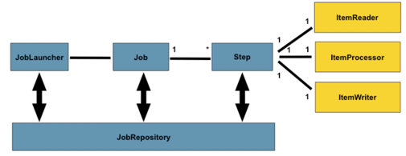
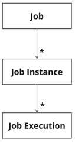
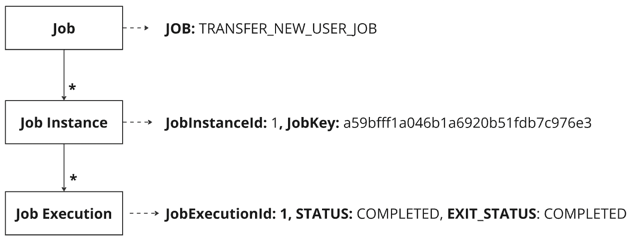
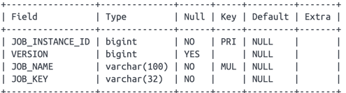
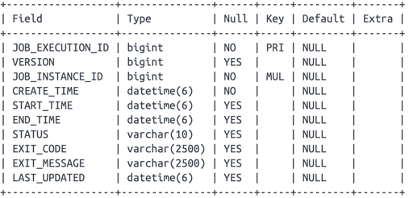
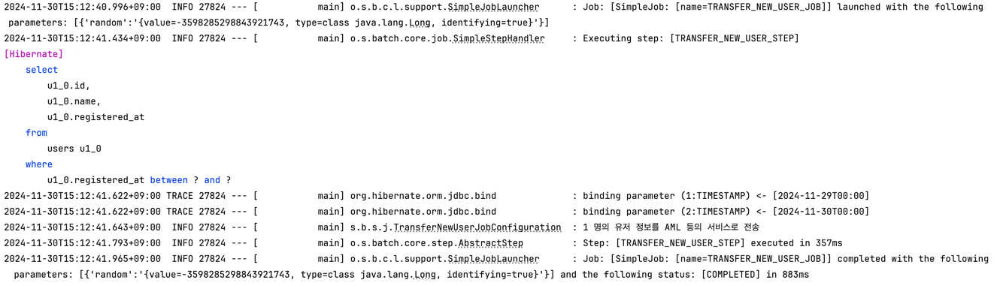
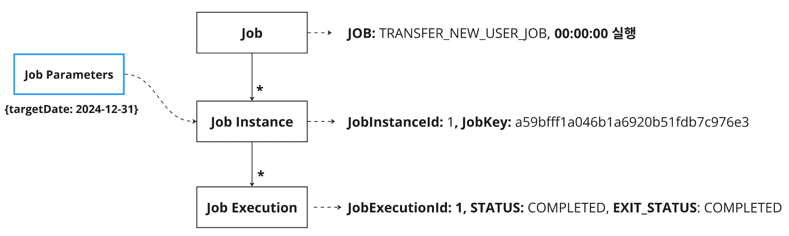

# 2. 스프링 배치 기본 구성 - Job & Step & ExecutionContext

Batch의 기본 구성에 대해 개략적으로 알아본다. 
Batch를 구성하는 주요 컴포넌트를 살펴보고, Spring Batch가 간단한 작업부터 복잡한 애플리케이션에 이르기까지 어떻게 유지보수가 용이한 설계 방식을 가지는지 살펴본다.  


## 2.1 배치의 기본 구성요소


위 다이어그램이 스프링 배치를 구성하는 주요 개념이라고 공식문서에서 소개하고 있다. 
배치의 일반적인 구성 방식이라고 할 수 있는데,
`Job`은 하나 이상의 Step으로 구성되며, 각 `Step`은 `ItemReader`, `ItemProcessor`, `ItemWriter`으로 구성된다.  
Job은 `JobLauncher`를 통해 실행되어야 하며, **현재 실행 중인 프로세스에 대한 메타데이터**는 `JobRepository`에 저장된다.  


## 2.2 Job

[이전 글]()에서 예시 코드를 작성하면서, Job을 익혔다. 공식 문서에서는 Job을 "전체 배치 프로세스를 캡슐화하는 엔티티"라고 표현하고 있다. 
Job에 대한 개념이 없는 상태라면 해당 표현이 좀 추상적인데, 쉽게 말해 Job은 Batch 작업 단위를 의미한다.  
이전 글에서 사용한 표현을 빌려쓰자면, 소위 말하는 Batch Job이 이 Job을 의미하는 것이며, 일련의 작업을 수행한다. 
예를 들어, "한 기능에 대한 배치를 작성해야돼"라고 한다면, 하나의 Batch Job을 만든다는 의미다. 

Job은 스프링의 다른 프로젝트와 마찬가지로, XML로 설정할 수도, Java 코드로 설정할 수도 있다. 그리고, 이 구성을 **Job Configuration**이라고 한다.   
그래서, 소스코드로 Job을 정의할 때는 `@Configuration`이 붙는다.  

아래 다이어그램을 보자. 아래 다이어그램은 Job의 계층 구조를 나타낸 것인데, 왜 Job이 "전체 배치 프로세스를 캡슐화하는 엔티티"인지 이해가 될 것이다. 



`Job`은 전체 계층 구조의 최상위에 위치한 개념이다. 즉, **배치 작업을 논리적으로 정의하는 최상위 개념**이다.  
`Job Instance`는 **Job을 실행한 논리적 인스턴스**이다.  
`Job Execution`은 각 **실행 자체를 의미**한다. **실행에 대한 상태**를 가진다. 또한, 논리적인 실행 단위인 JobInstance가 여러번 실행될 수 있기 때문에 1:N 구조가 형성된다.  

코드와 함께 각 의미를 살펴보자.  

### 2.2.1 예시 코드

#### - TransferNewUserJobConfiguration.java
```java
@Slf4j
@Configuration // Job 구성정보 설정
@RequiredArgsConstructor
public class TransferNewUserJobConfiguration {

    private final JobRepository jobRepository;
    private final PlatformTransactionManager platformTransactionManager;
    private static final String JOB_NAME = "TRANSFER_NEW_USER_JOB";
    private static final String STEP_1_NAME = "TRANSFER_NEW_USER_STEP";

    private final UserService userService;

    @Bean
    public Job transferNewUserJob() {
        return new JobBuilder(JOB_NAME, jobRepository)
            .start(transferNewUserStep()) // step 정의
            .build();
    }

    @Bean
    public Step transferNewUserStep() {
        return new StepBuilder(STEP_1_NAME, jobRepository)
            .tasklet((contribution, chunkContext) -> { 
                final List<User> users = userService.getUsersRegisteredYesterday(); // 어제 가입한 유저를 조회
                log.info("{} 명의 유저 정보를 AML 등의 서비스로 전송", users.size());
                return RepeatStatus.FINISHED;
            }, platformTransactionManager)
            .build();
    }
} 
```

(코드 설명은 [여기]()를 참고)
위 코드는 _TRANSFER_NEW_USER_JOB_ 이란 이름을 가진 Job을 정의한 코드다. 해당 Job에는 하나의 Step을 가지고 있다.  
해당 코드를 다이어그램을 통해 확인해보면 아래와 같다.  



- 위에서 설명한 Job, JobInstance, JobExecution 개념에 빗대어 이해하면, 위와 같은 구조로 Job이 해석된다.  
다이어그램에 적혀있는 JobInstanceId, JobKey, JobExecutionId 등을 이해하기 위해서는 **메타데이터**를 이해해야 한다.
간략하게 짚고 넘어가보자.

<br>

### 2.2.2 Spring Batch Meta-Data

스프링 배치는 메타데이터를 관리한다. 자세한 내용은 [메타데이터 포스팅]()을 참고하면 된다.  
이 메타데이터 중에는 JobInstance, JobExecution이 포함되는데, 두 데이터의 스키마만 파악해보자.  


#### - BATCH_JOB_INSTANCE



- `JOB_INSTANCE_ID`: 말그대로 ID다.(PK)
- `VERSION`: optimistic lock과 관련된 개념으로 자세한 내용은 [여기서]() 확인 가능하다.
- `JOB_NAME`: Job이 가지는 이름이다. 해당 예제에서는 _TRANSFER_NEW_USER_JOB_ 이 된다.
- `JOB_KEY`: 특정 Job이 가지는 고유한 Key이다. 해당 키는 JobParameters를 직렬화/해싱한 값이다. 
즉, 동일한 `JOB_NAME`에서 JobParameter에 따라 동일한 Job 여부가 판단되는데, 자세한 내용은 아래 JobParameters절에서 설명한다. 

<br>

#### - BATCH_JOB_EXECUTION



- `JOB_EXECUTION_ID`: Job Execution의 ID다.
- `JOB_INSTANCE_ID`: BATCH_JOB_INSTANCE를 FK로 가진다.
- `STATUS`: 실행 상태를 나타내는 필드다. `BatchStatus` enum 값을 따른다. 
- `EXIT_STATUS`: 실행 종료 후의 상태를 나타내는 필드다. `ExitStatus` class의 상수 값을 따른다.

각 필드의 자세한 설명은 뒤에 나오는 포스팅들에서 자세하게 설명한다. 
예시를 실행시켜 보면서 메타데이터에 들어가는 값을 두 눈으로 확인하는 것이 가장 직관적인 이해가 가능하므로 (해당 글에서) 자세한 설명은 생략한다.   

여기서는 JobInstance와 JobExecution의 관계에 대해서만 집중하자.  


### 2.2.3 다시 예제코드 설명

다시 돌아와서 아래 다이어그램을 이해해보자.  


- `Job`: 최상위에 위치한 논리적 개념으로, 배치 작업 그 자체를 의미한다. 
- `Job Instance`: Job을 실행한 인스턴스로, 고유한 식별 키를 가진다. 이 키는 JobKey로 JobParameter를 직렬화/해싱하여 만든 값이다.
즉, 동일한 Job 이름에 대해 동일한 JobParameter로 중복 실행하는 것을 방지한다.  
- `Job Execution`: Job의 실행 자체를 의미하는 데이터로, 실행에 대한 상태를 가진다. 여기서는 현재 실행 상태와 종료 상태 모두 '완료'임을 의미한다.  


## 2.3 JobInstance
위에서 Job을 설명하면서, JobInstance가 무엇을 의미하는지 파악했다.  
위 예시를 그대로 살려 'JobInstance 그 자체'가 무엇을 의미하는 논리적 개념인지 파악해보자.  

#### 예시 시나리오
```markdown
- 전일 가입한 유저를 AML 서버로 전달해야 한다. (AML, Anti-Money Laundering: 자금세탁행위를 차단하기 위한 관리 체계)
- 하루가 끝나는 "자정"에 한 번 실행된다.
```

위와 같은 요구사항이 있을 때, JobInstance의 의미는 아래와 같다.
- 1월 1일 자정에 실행되는 JobInstance는 12월 31일에 가입한 유저 데이터를 처리한다.
- 1월 2일 자정에 실행되는 JobInstance는 1월 1일에 가입한 유저 데이터를 처리한다.

여기서, JobInstance는 **작업이 어떤 데이터를 처리하는지와 관련된 논리적 단위**인 것이다.
즉, 1월 1일에 실행된 JobInstance와 1월 2일에 실행된 JobInstance는 별개의 작업인 셈이다. (처리할 대상, 즉 Job Parameter가 각각 12월 31일/1월 1일로 다르므로)


#### 2.2에서 정의한 Job 실행해보기

- [TransferNewUserJobConfigurationTest]()
```java
@Testcontainers
@SpringBootTest
@SpringBatchTest
class TransferNewUserJobConfigurationTest extends TestTemplate {

    @Autowired
    private Job transferNewUserJob;
    @Autowired
    private JobLauncherTestUtils jobLauncherTestUtils;

    @Autowired
    private UserRepository userRepository;
    @Autowired
    private DatabaseTemplate databaseTemplate;

    @BeforeEach
    void setup() {
        jobLauncherTestUtils.setJob(transferNewUserJob);
        databaseTemplate.truncate();
    }

    @Test
    @SneakyThrows
    void run() throws Exception{
        // given
        final User user = UserFixture.create(LocalDateTime.now().minusDays(1));
        userRepository.save(user);
        
        // when
        JobExecution jobExecution = jobLauncherTestUtils.launchJob();

        // then
        assertThat(jobExecution.getStatus()).isEqualTo(BatchStatus.COMPLETED);
    }
}
```
위 코드는 실행하는 [테스트 코드]()이고, 실행 결과는 아래와 같다.



정상적으로 어제 가입한 유저를 조회하고, 로그를 출력했다.  
그런데, 이 예제코드(2.2.1절)에는 **JobParameters라는걸 찾아볼 수가 없다**. 다르게 말하면 **Job을 식별할 키가 없는 것**이다.
때문에 동일한 Job에 대한 중복 실행으로 인식하여 에러를 뱉을 것이다.(이때 뱉는 Exception은 `JobInstanceAlreadyCompleteException`)

**참고**  
위에서 작성한 예시 코드에는 JobParmeters가 없다. 때문에, 위 내용대로라면 중복 Job으로 인식되니 `JobInstanceAlreadyCompleteException`가 발생한다.  
하지만 현재 [JobLauncherTestUtils](https://docs.spring.io/spring-batch/docs/current/api/org/springframework/batch/test/JobLauncherTestUtils.html)을 사용해 배치 테스트를 실행시키고 있다.
해당 유틸 클래스는 중복 실행을 방지하기 위해 임의로 랜덤값을 생성해 parameter 중복을 방지해주니 참고하자.


여기서 한번 끊고, JobParameters로 넘어가보자.  


## 2.4 JobParameter
위에서 설명한 것처럼 JobInstance를 구분하는 "방법"은 바로 `JobParameters`다. 다이어그램에 JobParameter를 추가하면 아래와 같다.  



12월 31에 가입한 유저 리스트를 가져오기 위해, Job이 수행할 대상 파라미터를 2024-12-31로 넘긴다. 
즉, 수행되는 JobInstance는 **이름이 "TRANSFER_NEW_USER_JOB"이고, 파라미터가 "2024-12-31"인 인스터스**라고 정의할 수 있다.  

정리하면, JobInstance는 **Job + JobParameters**으로 식별된다.  
아래는 실제 batch 메타데이터 테이블을 생성하는 DDL 스크립트를 가져온 것이다. 


BATCH_JOB_INSTANCE의 유니크 제약조건을 보면, `JOB_NAME`과 `JOB_KEY`로 걸려있는 것을 확인할 수 있다.  
(위에서 설명한 것처럼 JOB_KEY는 JobParameters를 직렬화/해싱한 값을 의미)

**주의**  
하지만, JobParameters의 **모든 파라미터가 JobInstance 식별에 기여하지 않을 수도 있다**. 특정 파라미터는 JobInstance의 식별과 무관하게 동작하도록 설정할 수 있음을 의미한다.  
그때 사용되는 것이 `identifying` 이라는 boolean 값이다.  

예시코드를 좀 발전시켜, **JobParameter**를 넘겨보자.  

#### 예시 시나리오
```markdown
- 전일 가입한 유저를 AML 서버로 전달해야 한다. (AML, Anti-Money Laundering: 자금세탁행위를 차단하기 위한 관리 체계)
- 배치가 돌아가는 시점은 2024-01-01 00:00:00이고, 파라미터는 2024-12-31이다. 
```

#### 예시 코드

- [TransferNewUserJobConfiguration]()
```java
@Slf4j
@Configuration
@RequiredArgsConstructor
public class TransferNewUserJobConfiguration {

    private final JobRepository jobRepository;
    private final PlatformTransactionManager platformTransactionManager;
    private static final String JOB_NAME = "TRANSFER_NEW_USER_JOB";
    private static final String STEP_1_NAME = "TRANSFER_NEW_USER_STEP";

    private final UserService userService;

    @Bean
    public Job transferNewUserJob() {
        return new JobBuilder(JOB_NAME, jobRepository)
            .start(transferNewUserStep(null))
            .build();
    }

    @Bean
    @JobScope
    public Step transferNewUserStep(
        @Value("#{jobParameters['targetDate']}") LocalDate targetDate
    ) {
        return new StepBuilder(STEP_1_NAME, jobRepository)
            .tasklet((contribution, chunkContext) -> {
                final List<User> users = userService.findByRegisteredDate(targetDate);
                log.info("{} 명의 유저 정보를 AML 등의 서비스로 전송", users.size());
                return RepeatStatus.FINISHED;
            }, platformTransactionManager)
            .build();
    }
}
```

- [UserService]()
```java
@Service
@RequiredArgsConstructor
public class UserService {

    private final UserRepository userRepository;

    public List<User> findByRegisteredDate(final LocalDate targetDate) {
        return userRepository.findByRegisteredDate(targetDate);
    }
}
```
**TransferNewUserJobConfiguration**를 자세히 살펴보자.

`@Value("#{jobParameters['targetDate']}") LocalDate targetDate` 라는 파라미터가 추가 되었다. 
그리고, 이 전달받은 파라미터를 통해 어제 가입한 유저만 (UserService를 통해) 조회해오는 상황이다.  

/// jobParameters @Value 이 코드 내부 동작 딥-다이브 해서 정리

/// testcode 도 올려서, job Paramter 어떻게 생성하는지 확인, 그리고 identifying 필드에 대해서도 확인
/// 그냥 중복 실행하면 JobInstanceAlreadyCompleteException 나오는거 확인
/// identifying true/false에 따라 또 JobInstanceAlreadyCompleteException 나오는거 확인


/// JobExecution 정리
